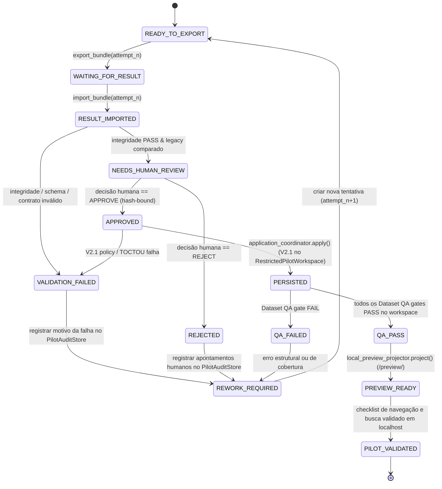

# Daemon Tools — Version 2.2 Design Specification
# Pilot Content Pipeline (End-to-End Book Verification)

## 1. Visão Geral e Contexto

Esta especificação define a arquitetura, contratos de dados, máquina de estados, governança de direitos autorais, protocolo de auditoria e fluxo de execução da **Version 2.2 — Pilot Content Pipeline** do repositório Daemon Tools.

O objetivo central da Versão 2.2 é fechar o ciclo operacional completo de transformação de dados processando **um livro real** desde sua fonte original não estruturada até sua visualização navegável, pesquisável e com relações ativas em ambiente de preview local seguro, exercitando todas as camadas do pipeline:
```text
Fonte Original (Livros/)
  ↓
SOURCE (Inventário, integridade, direitos)
  ↓
EXTRACTION (Texto bruto, limpeza, parágrafos)
  ↓
EDITORIAL (Segmentação, classificação, cobertura de páginas)
  ↓
ENTITIES (Extração e tipagem canônica de entidades)
  ↓
RELATIONS (Grafos de regras, vínculos e referências cruzadas)
  ↓
VALIDATION (Validação técnica determinística de schemas e contratos)
  ↓
LEGACY COMPARISON (Comparação determinística sem LLM contra histórico)
  ↓
PILOT HUMAN REVIEW (Solicitação formal vs Decisão humana hash-bound)
  ↓
V2.1 PERSISTENCE (Mutação atômica segura via ApplicationCoordinator no RestrictedPilotWorkspace)
  ↓
QA / DATASET GATES (Validação determinística de conformidade e integridade no workspace)
  ↓
LOCAL PREVIEW PROJECTION (Projeção runtime-only isolada em <runtime>/preview/)
  ↓
LOCAL HTTP PREVIEW (Navegação, busca e relações ativas via runtime overlay local)
```

---

## 2. V2.1 Baseline e Cláusulas Pétreas

A Versão 2.2 tem como alicerce estrito a **Version 2.1 — Persistence/Application Layer**, congelada e verificada na tag:
- **Tag:** `multiagent-persistence-v2.1`
- **SHA:** `d4622b3cdee956f5cb8dfff34df0a98e3e4dfe13`

Todas as garantias e invariantes de segurança da V2.1 permanecem vigentes e inalteradas:
1. **Zero Mutação Fora da V2.1:** Toda e qualquer escrita no sistema de arquivos passa obrigatoriamente pelo `ApplicationCoordinator` / `ChangeSetApplier` da V2.1. O pipeline piloto e seus agentes não possuem autoridade de escrita paralela.
2. **ACCEPT Boundary Inviolável:** O construtor de alterações (`ChangeSetBuilder`) e o coordenador de aplicação exigem deterministamente que o veredicto de validação técnica seja `ACCEPT`.
3. **Interseção Estrita de Autoridade:** $\text{Scope} = \text{allowedWriteScope} \cap \text{AutoApplyRoots} \cap \text{ApplicationPolicy}$. O request jamais pode expandir raízes de aplicação.
4. **Proteção TOCTOU e Primitivas Atômicas:** Revalidação de estado em disco na Fase 4 pré-mutação, criação atômica exclusiva (`open(..., "xb")` / `O_EXCL`), substituição unitária no mesmo volume (`os.replace`) e journal de rollback compensatório com detecção de adulteração concorrente.
5. **Isolamento de Staging e Bundles:** Os pacotes operacionais e áreas de staging residem fora da árvore Git, no mesmo sistema de arquivos do repositório (`<repo-parent>/.daemon_runtime/`).

---

## 3. Goals e Non-Goals

### 3.1 Goals (Metas da Versão 2.2)
1. **Processar 1 Livro Real:** Executar a cadeia completa de extração, estruturação, catalogação e integração de uma obra a partir de sua fonte original em `Livros/word/`.
2. **Exercitar Todos os Estágios do Pipeline:** SOURCE, EXTRACTION, EDITORIAL, ENTITIES, RELATIONS, VALIDATION, QA e LOCAL PREVIEW.
3. **Operacionalizar a Ponte de Transporte Manual com Antigravity:** Implementar o protocolo estruturado de exportação de `ExecutionBundle` e importação de `ResultBundle` para operação assistida por humano, sem automações frágeis.
4. **Vínculo Criptográfico Bidirecional de Bundles:** Garantir que o pacote de resposta esteja amarrado por hashes imutáveis (`requestId`, `executionBundleId`, `inputManifestSha256`, `artifactHashes`) ao pacote de entrada.
5. **Validador de Integridade de Importação:** Estabelecer a fronteira `BundleIntegrityValidator` para barrar dados corrompidos, incompletos ou adulterados antes de qualquer avaliação de regras de negócio.
6. **Comparador Determinístico com Legado (`LegacyComparator`):** Contrastar estruturalmente o resultado do pipeline com referências derivadas antigas para alertar o operador humano sobre divergências mecânicas, sem uso de LLM e sem conferir autoridade ao legado.
7. **Separação Formal entre Review Request e Review Decision:** Registrar a solicitação de revisão e vincular criptograficamente a decisão humana de aprovação ao hash SHA-256 exato do manifesto do resultado revisado.
8. **Auditoria de Governança Confiável e Segregada (`PilotAuditStore`):** Persistir evidências de governança em armazenamento durável controlado pelo runtime confiável, fora do repositório e totalmente inacessível a auto-apply de ChangeSets de conteúdo.
9. **Isolamento de Conteúdo Restrito (`RestrictedPilotWorkspace`):** Para obras com direitos restritos ou desconhecidos (`NOT_PUBLIC` / `UNKNOWN`), persistir o conteúdo gerado através da V2.1 exclusivamente em workspace de runtime isolado fora da working tree do repositório principal.
10. **Projeção de Preview Runtime-Only (`LocalPreviewProjector`):** Projetar dados de preview exclusivamente em diretório de runtime não rastreado (`<runtime>/preview/<bookId>/`), servido por overlay local sem tocar a árvore `docs/`.
11. **Preservação da Working Tree Principal Limpa:** O checkout principal do Git permanece 100% limpo de payloads derivados de conteúdo restrito.
12. **Testabilidade Hermética:** 100% dos novos componentes testáveis offline em fixtures isoladas, sem tokens, segredos ou chamadas externas.

### 3.2 Non-Goals (Fora do Escopo da Versão 2.2)
1. **Promoção de Conteúdo Restrito para a Working Tree Principal:** O conteúdo gerado do piloto restrito não é copiado para `data/` do repositório principal na V2.2.
2. **Deploy ou Publicação em Produção:** Proibida a publicação automática ou manual de conteúdo restrito no GitHub Pages público.
3. **Materialização de Conteúdo Restrito em `docs/`:** Dados derivados de fontes `NOT_PUBLIC` ou `UNKNOWN` jamais entram na árvore rastreada pelo Git (`docs/assets/data/`). Repositórios e branches públicas não são ambientes privados.
4. **Automação de API com Antigravity / Gemini:** A integração programática de rede permanece classificada como `DEFERRED_PENDING_RUNTIME_API`.
5. **Automação de Interface ou Navegador:** Proibido o uso de Selenium, Playwright, Puppeteer, PyAutoGUI ou similares.
6. **Assinaturas Digitais PKI:** A integridade é garantida por hashes SHA-256 canônicos e amarração de manifestos; infraestrutura de certificados assimétricos é postergada.
7. **Reconciliação Semântica Automática:** O `LegacyComparator` não interpreta significados nem usa IA. Divergências semânticas exigem deliberação humana.
8. **Redesign do Frontend ou Migração de Stack:** Nenhuma reescrita em React, Vue, Svelte ou Next.js. Proibida a introdução de novos design systems ou bibliotecas pesadas de UI.
9. **Processamento em Lote Multi-Livro ou Swarm:** Apenas 1 livro piloto será processado em sequência controlada.

---

## 4. Invariante de Segurança: `RESTRICTED_CONTENT_NEVER_ENTERS_MAIN_WORKTREE`

> [!CAUTION]
> **INVARIANTE CRÍTICA DE SEGURANÇA:**  
> Conteúdo derivado de fontes com `rightsStatus in (UNKNOWN, PRIVATE)` ou `publicationMode == NOT_PUBLIC` que exceda o nível de divulgação autorizado **NUNCA DEVE ENTRAR NA WORKING TREE DO REPOSITÓRIO PRINCIPAL**.  
> Esta proibição é absoluta: aplica-se a `data/text/`, `data/books/`, `data/entities/`, `data/pilot/`, `docs/assets/data/` e a qualquer outro caminho rastreado ou comitável no Git, mesmo como arquivos não commitados ou em branches de desenvolvimento. Branches em repositórios públicos são públicas; não existe privacidade em working trees rastreadas.

---

## 5. Seleção Determinística do Livro Piloto e Evidência Canônica de Direitos

### 5.1 Status da Working Tree de `data/pilot/`
A auditoria formal no repositório comprovou:
- `data/pilot/` pertence à working tree rastreada pelo Git (`git ls-files data/pilot/` lista 39 arquivos versionados).
- Como consequência, materializar arquivos de um piloto restrito diretamente em `data/pilot/` violaria frontalmente a política de não-vazamento de conteúdo restrito.
- Portanto, o conteúdo do piloto restrito deve ser persistido em um **workspace isolado de runtime**.

### 5.2 Shortlist Auditada e Evidência Canônica de Direitos

Em conformidade com a Constituição do Projeto (Seção 8):
> `UNKNOWN` nunca deve virar permissão implícita. Na ausência de documento formal de liberação assinado pelos detentores dos direitos ou comprovação de domínio público, o status canônico padrão é estritamente `rightsStatus = UNKNOWN` e o modo de publicação é `publicationMode = NOT_PUBLIC`.

| Livro Candidato | Págs. | Chars | Áreas Representadas | Registro Canônico | rightsStatus | publicationMode | eligible_for_local_pilot | eligible_for_public_release |
|:---|:---:|:---:|:---|:---|:---:|:---:|:---:|:---:|
| **1. animalidade** | 13 | 58.659 | Lore, Regras, Rituais, Poderes, Aprimoramentos, Raças, NPCs | `data/index/sources.json` (`Livros/animalidade.pdf`, `Livros/word/animalidade.docx`) | `UNKNOWN` | `NOT_PUBLIC` | **SIM** | **NÃO** |
| **2. alastores-a-justica-infernal** | 43 | 88.518 | Lore, Poderes, Aprimoramentos, Classes, Itens, Rituais, NPCs | `data/index/sources.json` (`Livros/Alastores - A Justiça Infernal.pdf`) | `UNKNOWN` | `NOT_PUBLIC` | **SIM** | **NÃO** |
| **3. anoes** | 8 | 37.190 | Aprimoramentos, Lore, Itens, Kits, Raças | `data/index/sources.json` (`Livros/anoes.pdf`) | `UNKNOWN` | `NOT_PUBLIC` | **SIM** | **NÃO** |
| **4. anjos-cacadores-alados** | 43 | 116.108 | Lore, Raças, Manobras, Aprimoramentos, Poderes, NPCs | `data/index/sources.json` (`Livros/Anjos cacadores-alados.pdf`) | `UNKNOWN` | `NOT_PUBLIC` | **SIM** | **NÃO** |

### 5.3 Decisão de Seleção: `animalidade` como Piloto Restrito
O suplemento **`animalidade`** é designado como o piloto da V2.2 sob governança estrita:
- **PILOT MODE:** `LOCAL_RESTRICTED`
- **PUBLIC DEPLOYMENT:** `BLOCKED`
- **PROMOTION TO MAIN WORKTREE:** `BLOCKED`
- **Classificação dos Dados Gerados:** **`Restricted Pilot Candidate Data`** (não são dados publicamente canônicos do repositório).
- **Justificativa Técnica:** 13 páginas, texto íntegro, excelente riqueza de regras Daemon, ideal para exercício manual do pipeline.
- **Regra de Não-Contaminação:** O pipeline começa obrigatoriamente de `Livros/word/animalidade.docx`. Os arquivos antigos (`data/pilot/animalidade.json`, `data/books/animalidade.json`) servem unicamente ao `LegacyComparator` como espelho comparativo, nunca como entrada de extração.

---

## 6. Arquitetura de Persistência Restrita (`RestrictedPilotWorkspace`)

Para satisfazer simultaneamente a exigência de que **a V2.1 seja o único mecanismo de persistência** e a invariante de que **conteúdo restrito jamais entre na working tree principal**, a V2.2 introduz a fronteira conceitual do `RestrictedPilotWorkspace`.

### 6.1 Estrutura do `RestrictedPilotWorkspace`
Localizado fora da árvore do repositório Git, no mesmo sistema de arquivos/volume:
```text
<repository-parent>/.daemon_runtime/
└── workspaces/
    └── pilot/
        └── animalidade/
            └── repository/                  <-- repository_root para a V2.1
                └── data/
                    ├── text/
                    ├── books/
                    ├── entities/
                    └── pilot/
```

### 6.2 Propriedades Obrigatórias do `RestrictedPilotWorkspace`:
1. **Runtime-owned:** Pertence e é gerenciado exclusivamente pelo runtime local.
2. **Outside Main Working Tree:** Fisicamente localizado fora da pasta do repositório Daemon Tools.
3. **Untracked pelo Git:** Não possui remote público, não é comitável no repositório principal e não é servido pelo GitHub Pages.
4. **Não Controlável por LLM:** O caminho é configurado deterministicamente pelo runtime confiável com base na matriz de direitos. O modelo, o prompt e o Result Bundle não podem escolher nem alterar essa raiz.
5. **Mesmo Sistema de Arquivos (Same-Volume):** Permite que a validação de mesmo filesystem do `StagingManager` (`verify_same_filesystem()`) opere com sucesso, garantindo operações atômicas sem fallback de cópia e deleção.

### 6.3 Compatibilidade Nativa com a Implementação V2.1
A auditoria técnica da camada V2.1 confirmou que `ApplicationRuntimeConfig.create(repository_root=...)` aceita qualquer caminho absoluto confiável no mesmo filesystem. Portanto:
- O `ApplicationCoordinator` é instanciado com `repository_root = RestrictedPilotWorkspace`.
- **Mesmas Validações V2.1:** Schema de ChangeSet, ACCEPT boundary, allowlist de AutoApplyRoots, limites de recursos e integridade de UTF-8.
- **Mesma Política e Precondições:** Verificação de não-existência para CREATE, base hash para UPDATE e proteção contra symlinks/reparse points.
- **Mesmo Staging e Primitivas Atômicas:** `open(..., "xb")` exclusivo, `os.replace` no mesmo volume e transaction journal com rollback compensatório.
- **Resultado:** A V2.1 é preservada integralmente como o único motor de persistência, sem criação de código paralelo de escrita em disco.

---

## 7. Matriz Canônica de Direitos e Fronteiras de Projeção

A autorização de qualquer projeção pública é determinada de forma estrita e canônica pelo `GateEngine` e pela política de direitos para a **projeção exata solicitada**. O `PublishProjector` não reimplementa nem interpreta regras de direitos; ele opera unicamente como executor técnico subordinado ao veredicto determinístico emitido pelo `GateEngine`:

- **`AUTHORIZED` + modo de publicação compatível:** Potencialmente permitido (`ELEGÍVEL`, sujeito a QA PASS + Release Gates PASS + Decisão Humana de Release).
- **`PUBLIC_DOMAIN` + modo de publicação compatível:** Potencialmente permitido (`ELEGÍVEL`, sujeito a QA PASS + Release Gates PASS + Decisão Humana de Release).
- **`METADATA_ONLY` (permissão de metadados) + projeção restrita a metadados:** Potencialmente permitido (`ELEGÍVEL`, estritamente limitado aos metadados autorizados; requer QA PASS + Release Gates PASS + Decisão Humana).
- **`METADATA_ONLY` + projeção de texto integral (`FULL_TEXT`):** **NEGADO** (`DENIED`).
- **`PRIVATE`, `UNKNOWN` ou modo de publicação `NOT_PUBLIC`:** **NEGADO** (`DENIED`) para qualquer projeção pública de payload.

| rightsStatus | publicationMode | Projeção Solicitada | Veredicto de Direitos | Destino Autorizado | Mecanismo |
|:---|:---|:---|:---:|:---|:---|
| **`AUTHORIZED` / `PUBLIC_DOMAIN`** | `FULL_TEXT` / `SUMMARY_AND_METADATA` | Local Preview | **PERMITIDO** | `<runtime>/preview/<bookId>/` | `LocalPreviewProjector` |
| **`AUTHORIZED` / `PUBLIC_DOMAIN`** | `FULL_TEXT` / `SUMMARY_AND_METADATA` | Public Release | **ELEGÍVEL** (Requer QA + Gates + Human Release) | `docs/assets/data/` | `PublishProjector` |
| **`METADATA_ONLY`** | `METADATA_ONLY` | Metadata Local Preview | **PERMITIDO** | `<runtime>/preview/<bookId>/` | `LocalPreviewProjector` |
| **`METADATA_ONLY`** | `METADATA_ONLY` | Metadata Public Release | **ELEGÍVEL** (Requer QA + Gates + Human Release) | `docs/assets/data/` | `PublishProjector` |
| **`METADATA_ONLY`** | `METADATA_ONLY` | Full Text (Local ou Público) | **NEGADO** (`DENIED`) | N/A | Bloqueio imediato |
| **`PRIVATE`** | `NOT_PUBLIC` | Local Preview | **PERMITIDO** (Apenas dev local) | `<runtime>/preview/<bookId>/` | `LocalPreviewProjector` |
| **`PRIVATE`** | `NOT_PUBLIC` | Public Release | **NEGADO** (`DENIED`) | N/A | Bloqueio absoluto |
| **`UNKNOWN`** | `NOT_PUBLIC` | Local Preview | **PERMITIDO** (Apenas dev local) | `<runtime>/preview/<bookId>/` | `LocalPreviewProjector` |
| **`UNKNOWN`** | `NOT_PUBLIC` | Public Release | **NEGADO** (`DENIED`) | N/A | Bloqueio absoluto |

### 7.1 Separação entre `LocalPreviewProjector` e `PublishProjector`
1. **`LocalPreviewProjector` (Runtime-Only):**
   - **Fonte:** `RestrictedPilotWorkspace/data/pilot/<bookId>.json` (para conteúdo restrito) ou `data/pilot/<bookId>.json` (para conteúdo público autorizado).
   - **Destino:** `<repository-parent>/.daemon_runtime/preview/<bookId>/`.
   - **Operação:** Acionado somente após aprovação nos gates de QA do workspace. Alimenta o servidor HTTP local através de overlay em memória, mantendo `docs/` intocado.
2. **`PublishProjector` (Publicação / Deploy):**
   - **Autoridade:** Não possui autoridade de governança própria; subordina-se estritamente ao veredicto do `GateEngine` para a projeção exata solicitada.
   - **Condição:** Exige veredicto positivo explícito do `GateEngine`, aprovação formal em QA PASS, aprovação em Release Gates PASS e deliberação humana final de publicação.
   - **Status na V2.2:** **BLOQUEADO / DESATIVADO.** Não haverá qualquer publicação de dados na V2.2.

---

## 8. Arquitetura Operacional do Piloto Restrito

```text
┌────────────────────────────────────────────────────────────────────────────────────────┐
│ DAEMON RUNTIME (Local Engine)                                                          │
│                                                                                        │
│   [Pilot Job Definition (Attempt N)]                                                   │
│             ↓                                                                          │
│   [ExecutionBundleExporter]                                                            │
│             ↓                                                                          │
│   (.daemon_runtime/bundles/outgoing/<bundle-id>/) ──────────────────────────┐          │
└─────────────────────────────────────────────────────────────────────────────┼──────────┘
                                                                              │
                                                                     [Manual Transport]
                                                                     (Operador Humano)
                                                                              │
┌─────────────────────────────────────────────────────────────────────────────┼──────────┐
│ EXTERNAL MODEL ENVIRONMENT                                                  │          │
│                                                                             ▼          │
│   Antigravity / Gemini Workspace ──→ (Processa Prompt e Salva Output)                  │
│                                                                             │          │
└─────────────────────────────────────────────────────────────────────────────┼──────────┘
                                                                              │
                                                                     [Manual Transport]
                                                                     (Operador Humano)
                                                                              │
┌─────────────────────────────────────────────────────────────────────────────┼──────────┐
│ DAEMON RUNTIME (Local Engine)                                               ▼          │
│                                            (.daemon_runtime/bundles/incoming/<id>/)    │
│                                                                             ↓          │
│   [ResultBundleImporter]                                                               │
│             ↓                                                                          │
│   [BundleIntegrityValidator] ──→ (Falha?) ──→ [VALIDATION_FAILED]                      │
│             ↓ (Pass)                                                                   │
│   [ExecutionResultValidator] ──→ (Não ACCEPT?) ──→ [VALIDATION_FAILED]                  │
│             ↓ (Pass)                                                                   │
│   [LegacyComparator] (Determinístico, sem LLM)                                         │
│             ↓                                                                          │
│   [PilotReviewRequest] ──→ Gravado no PilotAuditStore (<runtime>/audit/)               │
│             ↓                                                                          │
│   [PilotReviewDecision] (Humano) ──→ Gravado no PilotAuditStore (Rejeição: REJECTED)   │
│             ↓ (Aprovação hash-bound)                                                   │
│   [ApplicationCoordinator V2.1]                                                        │
│             │ (trusted repository_root = RestrictedPilotWorkspace)                     │
│             ▼                                                                          │
│   [RestrictedPilotWorkspace/data/pilot/animalidade.json]                               │
│             ↓                                                                          │
│   [Pilot Dataset QA Gates] (Executados contra RestrictedPilotWorkspace)                │
│             ↓ (Pass)                                                                   │
│   [Rights Gate: UNKNOWN -> NOT_PUBLIC]                                                 │
│             ↓                                                                          │
│   [LocalPreviewProjector]                                                              │
│             ↓ (Copia para runtime untracked)                                           │
│   (<runtime>/preview/animalidade/)                                                     │
│             ↓                                                                          │
│   [Local HTTP Server Overlay] ──→ [Navegador do Desenvolvedor (localhost)]             │
│   (docs/index.html + docs/app.js + dados de <runtime>/preview/)                        │
│                                                                                        │
│   * Working tree principal do Git permanece 100% livre de dados de animalidade *       │
└────────────────────────────────────────────────────────────────────────────────────────┘
```

---

## 9. Máquina de Estados do Piloto e Modelo de Tentativas (Rework/Attempt Model)

### 9.1 Imutabilidade Absoluta de Bundles
- **Execution Bundle Exportado é Imutável:** Uma vez gravado na pasta `outgoing/`, torna-se somente leitura. É proibido editar um bundle in-place para "corrigir um prompt".
- **Result Bundle Importado é Imutável:** Uma vez recebido em `incoming/`, o pacote não pode ser alterado.
- **Rework Gera Nova Tentativa:** Se um resultado for corrompido, reprovado na validação ou rejeitado na revisão humana, o operador cria uma nova tentativa com identificador sequencial:
  ```text
  Job: JOB-ANIM-001-EXTRACTION
  ├── attempt 1 (EB-ANIM-001-att1 / RB-ANIM-001-att1) -> FAILED / REJECTED
  ├── attempt 2 (EB-ANIM-001-att2 / RB-ANIM-001-att2) -> APPROVED / PERSISTED
  └── ...
  ```
- **Sem Retry Automático:** O sistema nunca entra em loops de retry autônomos. Cada tentativa requer geração explícita de bundle e transporte manual pelo operador.

### 9.2 Diagrama de Estados do Piloto



---

## 10. Canonicalização e Algoritmo de Hashing de Bundles

Toda estrutura de metadados antes de ser hasheada deve ser convertida em bytes UTF-8 canônicos:
```python
def canonical_json_bytes(payload: dict) -> bytes:
    return json.dumps(
        payload,
        ensure_ascii=False,
        sort_keys=True,
        separators=(",", ":"),
    ).encode("utf-8")
```

### Regras de Hashing:
- **`inputManifestSha256`:** Calculado exclusivamente sobre o payload de conteúdo de `context-manifest.json` (`bundleId`, `requestId`, `jobId`, `stage`, `bookId` e `items`). O campo temporal `createdAt` é estritamente **excluído**.
- **`executionBundleId`:** Derivado deterministicamente como:
  `EB-<BOOK_ID>-<STAGE>-att<ATTEMPT_NUM>-<CONTENT_HASH[:8]>`.
- **`artifact hashes`:** SHA-256 calculado diretamente sobre os bytes físicos brutos de cada arquivo em `artifacts/`.
- **`resultManifestSha256`:** Calculado sobre a serialização canônica do conteúdo do `result-manifest.json`, excluindo auto-referências circulares.

---

## 11. Validador de Integridade de Importação (`BundleIntegrityValidator`)

O `BundleIntegrityValidator` impõe validações determinísticas antes de qualquer inspeção semântica:
1. **Validação de Schemas:** Conformidade estrita com `execution-result.schema.json` e `result-manifest.schema.json`.
2. **Amarração de Identidade Cruzada:** `requestId`, `executionBundleId` e `inputManifestSha256` idênticos aos registrados na saída.
3. **Integridade de Artefatos:** Hashes físicos de arquivos em disco devem bater byte-a-byte com os declarados no manifesto. Arquivos órfãos ou ausentes são estritamente proibidos.
4. **Hardening de Caminhos:** Proteção contra path traversal (`..`), drive letters, prefixos de dispositivo, ADS (`:`) e dispositivos reservados DOS.
5. **Limites de Recursos:** Limite de 50MB por arquivo e 200MB por bundle.

---

## 12. Comparador com Legado Determinístico (`LegacyComparator`)

> **O `LegacyComparator` não utiliza modelos de linguagem (LLM) e não interpreta livremente o texto.** Ele opera exclusivamente através de regras de comparação determinística sobre árvores sintáticas e estruturas canônicas normalizadas.

### Veredictos do Comparador:
1. **`SEMANTIC_EQUIVALENT`:** Apenas diante de prova estrutural determinística (mesmos IDs, mesmos tipos, mesmos valores normalizados de regras/atributos e mesmas relações; permitidas apenas variações de whitespace/formatação).
2. **`STRUCTURAL_DIFFERENCE_ONLY`:** Dados semanticamente equivalentes adaptados para os novos schemas canônicos.
3. **`SEMANTIC_DIFFERENCE`:** Divergências numéricas ou de regras mecânicas detectadas. Gera **bloqueio automático** e direciona para `HUMAN_REVIEW`.
4. **`NO_LEGACY_REFERENCE`:** Entidade nova descoberta na fonte original não presente no legado antigo.

---

## 13. Auditoria Confiável e Segregada (`PilotAuditStore`)

### 13.1 Segregação de Autoridade do `PilotAuditStore`
- **Autoridade:** Runtime confiável local (`PilotAuditStore`).
- **Isolamento Absoluto:** O motor de conteúdo da V2.1, os ChangeSets do modelo e as `AutoApplyRoots` **não possuem autoridade sobre o `PilotAuditStore`**.
- **Localização:** `<repository-parent>/.daemon_runtime/audit/pilot/<bookId>/`.
- **Diferenciação de Registros:**
  - `RestrictedPilotWorkspace`: Armazena **candidate content** gerado.
  - `PilotAuditStore`: Armazena **governance evidence** imutável.
- **Relação com Journals da V2.1:** A V2.1 mantém seus transaction journals originais em `.daemon_audit/`. O `PilotAuditStore` apenas armazena referências imutáveis (`transactionId` e hash do journal da V2.1).
- **Proteção contra Limpeza:** Expurgo de pacotes de bundles temporários ou dados de preview local **nunca remove** os registros do `PilotAuditStore`.

---

## 14. Governança de Revisão Humana: Separação entre Request e Decision

### 14.1 Solicitação de Revisão (`PilotReviewRequest`)
Gerada pelo sistema com resumo de alterações e discrepâncias contra o legado, armazenada pelo `PilotAuditStore`:
```json
{
  "$schema": "https://daemon.tools/schemas/pilot-review-request.schema.json",
  "reviewRequestId": "REV-REQ-ANIM-001-att1",
  "jobId": "JOB-ANIM-001",
  "attemptNumber": 1,
  "requestId": "req-anim-ext-001",
  "executionBundleId": "EB-ANIM-001-att1",
  "resultBundleId": "RB-ANIM-001-att1",
  "resultManifestSha256": "7c9f8e4d2a...",
  "legacyComparisonSummary": {
    "verdict": "SEMANTIC_DIFFERENCE_DETECTED",
    "equivalentCount": 14,
    "structuralDifferenceCount": 8,
    "semanticDifferenceCount": 2,
    "newEntitiesCount": 3,
    "discrepancies": [
      {
        "entityId": "feras-lobo",
        "field": "statBlock.attributes.FR",
        "legacyValue": 15,
        "extractedValue": 18,
        "sourceCitation": "Livros/word/animalidade.docx#p.11"
      }
    ]
  },
  "questionsToReviewer": [
    "Confirmar se a Força 18 do Fera Lobo é fidedigna à página 11 da fonte original."
  ],
  "status": "PENDING",
  "createdAt": "2026-09-08T18:20:00Z"
}
```

### 14.2 Decisão de Revisão (`PilotReviewDecision`)
Emitida pelo operador humano e gravada exclusivamente pelo `PilotAuditStore`. Não pode ser gerada pelo modelo:
```json
{
  "$schema": "https://daemon.tools/schemas/pilot-review-decision.schema.json",
  "reviewDecisionId": "REV-DEC-ANIM-001-att1",
  "reviewRequestId": "REV-REQ-ANIM-001-att1",
  "requestId": "req-anim-ext-001",
  "executionBundleId": "EB-ANIM-001-att1",
  "resultBundleId": "RB-ANIM-001-att1",
  "reviewedResultManifestSha256": "7c9f8e4d2a...",
  "decision": "APPROVE",
  "reviewer": "operador-humano",
  "reason": "Conferido contra a pág. 11 da fonte DOCX: Força 18 é a grafia exata original; o legado continha erro.",
  "decidedAt": "2026-09-08T18:30:00Z"
}
```

*Qualquer alteração em artefatos invalida a aprovação (`ERR_REVIEW_HASH_MISMATCH`).*

---

## 15. Estratégia de QA: Regressão do Repositório vs Dataset Restrito

A validação de qualidade é explicitamente dividida em duas suítes independentes:
1. **Repository Regression Gates:**
   - Executados contra a working tree do repositório principal:
     - `pytest tests/agents -q`
     - `pytest -q`
     - `python scripts/validate_data.py`
     - `python scripts/check_book_coverage.py`
     - `node --check docs/assets/app.js`
   - Garante que a base canônica pública existente permaneça 100% verde e inalterada.
2. **Restricted Pilot Dataset Gates:**
   - Executados especificamente apontando para `RestrictedPilotWorkspace`:
     - Validação de schemas dos dados extraídos do piloto;
     - Verificação de cobertura de páginas da obra piloto;
     - Verificação de proveniência (`source` e `pages`);
     - Verificação de grafos de relações canônicas no workspace isolado.
   - Garante que o dataset de `animalidade` não contamine as contagens do repositório principal.

---

## 16. Critérios de Conclusão da V2.2 para `animalidade` (`V2.2 VERIFIED`)

Para o livro piloto `animalidade`, o estado `V2.2 VERIFIED` é atingido quando:
1. Fonte original em `Livros/word/animalidade.docx` processada através de todos os estágios do pipeline.
2. Bundles manuais de transporte exportados, operados e importados com integridade comprovada.
3. Divergências contra o legado auditadas pelo `LegacyComparator` sem uso de IA.
4. Solicitações e decisões de revisão humana persistidas no `PilotAuditStore`.
5. Dados candidatos persistidos exclusivamente através da V2.1 no `RestrictedPilotWorkspace`.
6. A working tree principal e a árvore `docs/` mantidas 100% livres de payload derivado de `animalidade`.
7. Repository Regression Gates e Dataset Gates aprovados com sucesso.
8. Preview local via runtime overlay funcionando plenamente (navegação, busca, relações ativas em `localhost`).
9. Deploy público no GitHub Pages mantido estritamente bloqueado (`BLOCKED`).
10. **Promoção para o repositório principal:** Classificada como fora de escopo / `DEFERRED`. Não será realizada na V2.2.

---

## 17. Taxonomia Canônica de Falhas

| Código Canônico | Categoria | Descrição | Ação |
|:---|:---|:---|:---|
| `ERR_EXECUTION_BUNDLE_INVALID` | Export | Estrutura de bundle de saída malformada | Aborta exportação |
| `ERR_EXECUTION_BUNDLE_INTEGRITY_FAILED` | Export | Divergência no manifesto de contexto | Aborta exportação |
| `ERR_RESULT_BUNDLE_INVALID` | Import | Schema de pacote ou manifesto inválido | `VALIDATION_FAILED` |
| `ERR_RESULT_BUNDLE_INTEGRITY_FAILED` | Import | Hash de arquivo em disco diverge do manifesto | `VALIDATION_FAILED` |
| `ERR_REQUEST_ID_MISMATCH` | Binding | RequestId retornado não bate com a saída | `VALIDATION_FAILED` |
| `ERR_BUNDLE_ID_MISMATCH` | Binding | BundleId retornado não bate com a saída | `VALIDATION_FAILED` |
| `ERR_INPUT_MANIFEST_HASH_MISMATCH` | Binding | Manifesto de entrada referenciado diverge | `VALIDATION_FAILED` |
| `ERR_ARTIFACT_HASH_MISMATCH` | Integrity | Bytes em disco divergem do hash declarado | `VALIDATION_FAILED` |
| `ERR_UNEXPECTED_ARTIFACT` | Integrity | Arquivo presente na pasta mas ausente no manifesto | `VALIDATION_FAILED` |
| `ERR_MISSING_ARTIFACT` | Integrity | Arquivo declarado no manifesto ausente na pasta | `VALIDATION_FAILED` |
| `ERR_RESULT_CONTRACT_INVALID` | Contract | Falha na validação semântica da V2 | `VALIDATION_FAILED` |
| `ERR_SEMANTIC_DIFFERENCE_REQUIRES_REVIEW` | Legacy | Divergência mecânica contra dados legados | `NEEDS_HUMAN_REVIEW` |
| `ERR_REVIEW_REQUIRED` | Review | Tentativa de persistência sem decisão registrada | Bloqueia persistência |
| `ERR_REVIEW_REJECTED` | Review | Revisor humano emitiu decisão de REJECT | `REJECTED` -> `REWORK_REQUIRED` |
| `ERR_REVIEW_HASH_MISMATCH` | Review | Artefatos adulterados após decisão humana | Invalida decisão |
| `ERR_AUDIT_STORE_VIOLATION` | Audit | Violação de integridade ou autoridade no PilotAuditStore | `VALIDATION_FAILED` |
| `ERR_PERSISTENCE_FAILED` | Persistence| Rejeição ou falha de rollback na V2.1 | `VALIDATION_FAILED` |
| `ERR_QA_FAILED` | QA | Falha em testes de regressão ou dataset gates | `QA_FAILED` |
| `ERR_RESTRICTED_CONTENT_PROJECTION_BLOCKED`| Rights | Tentativa de projetar dados restritos para docs/ | Bloqueia projeção |
| `ERR_PREVIEW_PROJECTION_FAILED` | Preview | Falha ao projetar dados no runtime de preview | Bloqueia visualização |

---

## 18. Componentes e Sequência de Implementação (Tasks 35–44)

### 18.1 Schemas JSON (`schemas/`)
- `schemas/execution-bundle.schema.json`
- `schemas/result-bundle.schema.json`
- `schemas/pilot-review-request.schema.json`
- `schemas/pilot-review-decision.schema.json`

### 18.2 Módulos Python (`scripts/agents/`)
- `scripts/agents/canonical_json.py`: Serialização canônica e cálculo imutável de hashes.
- `scripts/agents/bundle_exporter.py`: Exportador de Execution Bundles e manifestos de contexto.
- `scripts/agents/bundle_importer.py`: Ingestor de Result Bundles.
- `scripts/agents/bundle_integrity_validator.py`: Validador determinístico de integridade e identidade.
- `scripts/agents/legacy_comparator.py`: Comparador estrutural determinístico sem LLM.
- `scripts/agents/pilot_audit_store.py`: Armazenamento de auditoria e governança durável no runtime.
- `scripts/agents/pilot_review.py`: Gerenciador de solicitações e decisões de revisão humana.
- `scripts/agents/preview_projector.py`: Projetor de preview runtime (`LocalPreviewProjector`).
- `scripts/agents/pilot_coordinator.py`: Orquestrador central da máquina de estados do piloto.

### 18.3 Sequência de Implementação Proposta
- **Task 35:** Canonical JSON serializer e schemas canônicos.
- **Task 36:** `ExecutionBundleExporter` com amarrações de contexto e hashing canônico.
- **Task 37:** `ResultBundleImporter` e leitura segura de pacotes.
- **Task 38:** `BundleIntegrityValidator` e verificador de amarração criptográfica.
- **Task 39:** `LegacyComparator` determinístico sem LLM.
- **Task 40:** `PilotAuditStore` e `PilotReviewEngine` (segregação de auditoria durável e decisão hash-bound).
- **Task 41:** `LocalPreviewProjector` e governança de direitos para preview local runtime-only.
- **Task 42:** `PilotCoordinator` com suporte a `RestrictedPilotWorkspace` via V2.1.
- **Task 43:** Adaptações pontuais manuais de desenvolvimento no frontend (`docs/index.html`, `docs/assets/app.js`).
- **Task 44:** Teste integrado hermético E2E e execução assistida do livro piloto real (`animalidade`).

---

## 19. Self-Review de Conformidade com a Revisão 003

- [x] **Zero dados de `animalidade` em `data/pilot/` principal:** Persistência configurada estritamente no `RestrictedPilotWorkspace`.
- [x] **Working tree principal preservada limpa:** Arquivos não entram em `data/` nem em `docs/` do repositório Git.
- [x] **V2.1 mantida como único motor de persistência:** O `ApplicationCoordinator` opera sobre o workspace isolado sem duplicação de primitivas.
- [x] **`repository_root` isolado configurado pelo runtime:** O modelo e os bundles são incapazes de selecionar a raiz.
- [x] **Terminologia exata adotada:** `Restricted Pilot Candidate Data` utilizado em vez de dados canônicos públicos.
- [x] **`LocalPreviewProjector` lê da fonte correta:** Consome dados de `RestrictedPilotWorkspace/data/pilot/` e grava em `<runtime>/preview/`.
- [x] **QA segregado em dois gates:** Regression gates do repositório vs Dataset gates do workspace.
- [x] **`PilotAuditStore` segregado do workspace:** Evidências de governança mantidas em `<runtime>/audit/`, separadas do conteúdo candidato.
- [x] **Critérios de `V2.2 VERIFIED` respeitam `NOT_PUBLIC`:** Deploy público bloqueado, validação restrita ao preview local.
- [x] **Invariante `RESTRICTED_CONTENT_NEVER_ENTERS_MAIN_WORKTREE` formalizada.**
