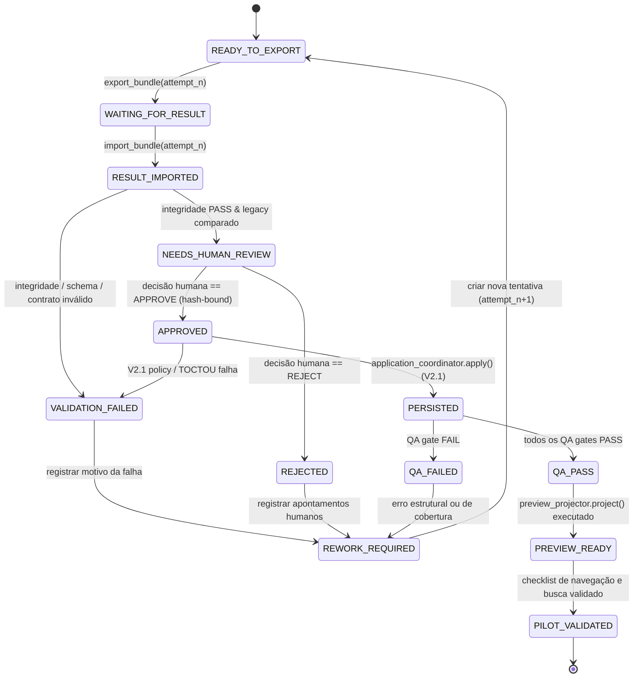

# Daemon Tools — Version 2.2 Design Specification
# Pilot Content Pipeline (End-to-End Book Verification)

## 1. Visão Geral e Contexto

Esta especificação define a arquitetura, contratos de dados, máquina de estados, governança de direitos autorais, protocolo de revisão humana e fluxo de execução da **Version 2.2 — Pilot Content Pipeline** do repositório Daemon Tools.

O objetivo central da Versão 2.2 é fechar o ciclo operacional completo de transformação de dados processando **um livro real** desde sua fonte original não estruturada até sua visualização navegável, pesquisável e com relações ativas no frontend atual, exercitando todas as camadas do pipeline:
```text
Fonte Original (Livros/)
  ↓
SOURCE (Inventário, integridade, direitos)
  ↓
EXTRACTION (Texto bruto, limpeza, parágrafos)
  ↓
EDITORIAL (Segmentação, classificação, cobertura de páginas)
  ↓
ENTITIES (Extração e tipagem canônica de entidades)
  ↓
RELATIONS (Grafos de regras, vínculos e referências cruzadas)
  ↓
VALIDATION (Validação técnica determinística de schemas e contratos)
  ↓
LEGACY COMPARISON (Comparação determinística sem LLM contra histórico)
  ↓
PILOT HUMAN REVIEW (Solicitação formal vs Decisão humana hash-bound)
  ↓
V2.1 PERSISTENCE (Mutação atômica segura via ApplicationCoordinator)
  ↓
QA / RELEASE GATES (Validação determinística de conformidade e integridade)
  ↓
PREVIEW PROJECTION (Projeção determinística de dados para o frontend)
  ↓
FRONTEND LOCAL PREVIEW (Navegação, busca e relações clicáveis)
```

---

## 2. V2.1 Baseline e Cláusulas Pétreas

A Versão 2.2 tem como alicerce estrito a **Version 2.1 — Persistence/Application Layer**, congelada e verificada na tag:
- **Tag:** `multiagent-persistence-v2.1`
- **SHA:** `d4622b3cdee956f5cb8dfff34df0a98e3e4dfe13`

Todas as garantias e invariantes de segurança da V2.1 permanecem vigentes e inalteradas:
1. **Zero Mutação Fora da V2.1:** Toda e qualquer escrita de dados no repositório passa obrigatoriamente pelo `ApplicationCoordinator` / `ChangeSetApplier` da V2.1. O pipeline piloto e seus agentes não possuem autoridade de escrita direta no repositório.
2. **ACCEPT Boundary Inviolável:** O construtor de alterações (`ChangeSetBuilder`) e o coordenador de aplicação exigem deterministamente que o veredicto de validação técnica seja `ACCEPT`.
3. **Interseção Estrita de Autoridade:** $\text{Scope} = \text{allowedWriteScope} \cap \text{AutoApplyRoots} \cap \text{ApplicationPolicy}$. O request jamais pode expandir raízes de aplicação.
4. **Proteção TOCTOU e Primitivas Atômicas:** Revalidação de estado em disco na Fase 4 pré-mutação, criação atômica exclusiva (`open(..., "xb")` / `O_EXCL`), substituição unitária no mesmo volume (`os.replace`) e journal de rollback compensatório com detecção de adulteração concorrente.
5. **Isolamento de Staging e Bundles:** Os pacotes operacionais e áreas de staging residem fora da árvore Git, no mesmo sistema de arquivos do repositório (`<repo-parent>/.daemon_runtime/`).

---

## 3. Goals e Non-Goals

### 3.1 Goals (Metas da Versão 2.2)
1. **Processar 1 Livro Real:** Executar a cadeia completa de extração, estruturação, catalogação e integração de uma obra a partir de sua fonte original em `Livros/word/`.
2. **Exercitar Todos os Estágios do Pipeline:** SOURCE, EXTRACTION, EDITORIAL, ENTITIES, RELATIONS, VALIDATION, FRONTEND, QA e RELEASE.
3. **Operacionalizar a Ponte de Transporte Manual com Antigravity:** Implementar o protocolo estruturado de exportação de `ExecutionBundle` e importação de `ResultBundle` para operação assistida por humano, sem automações frágeis.
4. **Vínculo Criptográfico Bidirecional de Bundles:** Garantir que o pacote de resposta esteja amarrado por hashes imutáveis (`requestId`, `executionBundleId`, `inputManifestSha256`, `artifactHashes`) ao pacote de entrada.
5. **Validador de Integridade de Importação:** Estabelecer a fronteira `BundleIntegrityValidator` para barrar dados corrompidos, incompletos ou adulterados antes de qualquer avaliação de regras de negócio.
6. **Comparador Determinístico com Legado (`LegacyComparator`):** Contrastar estruturalmente o resultado do pipeline com referências derivadas antigas para alertar o operador humano sobre divergências mecânicas, sem uso de LLM e sem conferir autoridade ao legado.
7. **Separação Formal entre Review Request e Review Decision:** Registrar a solicitação de revisão e vincular criptograficamente a decisão humana de aprovação ao hash SHA-256 exato do manifesto do resultado revisado.
8. **Projeção Determinística para Frontend (`PreviewProjector`):** Projetar dados canônicos aprovados para o caminho estático consumido pelo frontend (`docs/assets/data/pilot/`), somente após aprovação nos gates de QA e direitos.
9. **Integração Mínima com o Frontend Existente:** Permitir navegação, filtragem, busca e visualização de relações no visualizador existente (`docs/index.html`, `docs/assets/app.js`), sem refatorações de stack.
10. **Ambiente de Preview Local/Branch:** Validar o livro em servidor local (`localhost`) ou na branch de trabalho, mantendo o GitHub Pages público intocado.
11. **Testabilidade Hermética:** 100% dos novos componentes testáveis offline em fixtures isoladas, sem tokens, segredos ou chamadas externas.

### 3.2 Non-Goals (Fora do Escopo da Versão 2.2)
1. **Automação de API com Antigravity / Gemini:** A integração programática de rede permanece classificada como `DEFERRED_PENDING_RUNTIME_API`.
2. **Automação de Interface ou Navegador:** Proibido o uso de Selenium, Playwright, Puppeteer, PyAutoGUI ou similares.
3. **Assinaturas Digitais PKI:** A integridade é garantida por hashes SHA-256 e amarração de manifestos; infraestrutura de certificados assimétricos é postergada.
4. **Reconciliação Semântica Automática:** O `LegacyComparator` não interpreta significados nem usa IA. Divergências semânticas exigem deliberação humana.
5. **Publicação Automática em Produção:** O GitHub Pages público oficial não recebe deploy durante os testes do piloto.
6. **Redesign do Frontend ou Migração de Stack:** Nenhuma reescrita em React, Vue, Svelte ou Next.js. Proibida a introdução de novos design systems ou bibliotecas pesadas de UI.
7. **Processamento em Lote Multi-Livro ou Swarm:** Apenas 1 livro piloto será processado em sequência controlada.

---

## 4. Critérios de Sucesso do Piloto (`V2.2 VERIFIED`)

A Versão 2.2 só atinge o estado `V2.2 VERIFIED` quando os 12 critérios a seguir forem plenamente atendidos:

1. **Fonte Real Processada:** 1 livro selecionado deterministicamente a partir de seu arquivo original em `Livros/`.
2. **Cadeia Completa Concluída:** Dados transformados através de todos os estágios formais do pipeline.
3. **Ponte Manual Operada com Sucesso:** Exportação de bundles pelo Daemon, inferência assistida pelo Antigravity/Gemini e importação sem falhas de formato.
4. **Integridade de Bundle Validada:** `BundleIntegrityValidator` aprova a amarração de identidade, hashes de manifestos e ausência de adulteração.
5. **Divergências Semânticas Auditadas:** O `LegacyComparator` classifica todas as alterações e direciona diferenças para aprovação humana.
6. **Aprovação Humana Registrada e Vinculada:** Decisão formal de revisão emitida e vinculada criptograficamente ao manifesto do resultado.
7. **Persistência Exclusiva via V2.1:** Arquivos gravados no repositório estritamente através do `ApplicationCoordinator` da V2.1, com journals limpos e sem violações TOCTOU.
8. **QA Automatizado Verde:** Suíte de testes (`pytest`), `validate_data.py`, `check_book_coverage.py` e sintaxe JS aprovados com exit code 0.
9. **Navegabilidade Comprovada:** O livro piloto aparece no visualizador local, com listagem de seções e entidades.
10. **Busca Funcional:** Termos e entidades do livro piloto retornam nos filtros e busca do frontend.
11. **Relações Clicáveis:** Links cruzados entre entidades (ex.: poderes associados, pré-requisitos, regras de raça/kit) navegam corretamente na interface.
12. **Governança de Direitos Respeitada:** O livro permanece em modo de publicação compatível com seu status de direitos auditado, sem vazamento não autorizado para a base pública.

---

## 5. Seleção Determinística do Livro Piloto e Evidência Canônica de Direitos

### 5.1 Critérios Determinísticos de Avaliação da Shortlist
A seleção obedece a 6 dimensões determinísticas auditáveis:
- **C1. Disponibilidade de Fonte Original:** Arquivo DOCX íntegro em `Livros/word/`.
- **C2. Existência de Dados Legados:** Presença prévia em `data/books/` e `data/pilot/`.
- **C3. Qualidade da Fonte:** Documento com `badLineScore == 0.0` no relatório de qualidade (`word-docx-quality-report.json`).
- **C4. Extensão Gerenciável:** Entre 10 e 50 páginas (permite ciclo ágil de transporte manual sem cansaço operacional).
- **C5. Representatividade do Domínio Daemon:** Variedade de classes de entidades (mínimo 4 áreas: Lore, Regras, Opções/Poderes, NPCs).
- **C6. Governança de Direitos Canônicos:** Status de direitos auditado com base em evidência documental, sem inferências implícitas.

### 5.2 Shortlist Auditada e Evidência Canônica de Direitos

Em conformidade com a Constituição do Projeto (Seção 8):
> **Regra de Ouro de Direitos:** `UNKNOWN` nunca deve virar permissão implícita. Na ausência de documento formal de liberação assinado pelos detentores dos direitos ou comprovação de domínio público, o status canônico padrão é estritamente `rightsStatus = UNKNOWN` e o modo de publicação é `publicationMode = NOT_PUBLIC`.

| Livro Candidato | Págs. | Chars | Áreas Representadas | Registro Canônico | rightsStatus | publicationMode | eligible_for_local_pilot | eligible_for_public_release |
|:---|:---:|:---:|:---|:---|:---:|:---:|:---:|:---:|
| **1. animalidade** | 13 | 58.659 | Lore, Regras, Rituais, Poderes, Aprimoramentos, Raças, NPCs | `data/index/sources.json` (`Livros/animalidade.pdf`, `Livros/word/animalidade.docx`) | `UNKNOWN` | `NOT_PUBLIC` | **SIM** | **NÃO** |
| **2. alastores-a-justica-infernal** | 43 | 88.518 | Lore, Poderes, Aprimoramentos, Classes, Itens, Rituais, NPCs | `data/index/sources.json` (`Livros/Alastores - A Justiça Infernal.pdf`) | `UNKNOWN` | `NOT_PUBLIC` | **SIM** | **NÃO** |
| **3. anoes** | 8 | 37.190 | Aprimoramentos, Lore, Itens, Kits, Raças | `data/index/sources.json` (`Livros/anoes.pdf`) | `UNKNOWN` | `NOT_PUBLIC` | **SIM** | **NÃO** |
| **4. anjos-cacadores-alados** | 43 | 116.108 | Lore, Raças, Manobras, Aprimoramentos, Poderes, NPCs | `data/index/sources.json` (`Livros/Anjos cacadores-alados.pdf`) | `UNKNOWN` | `NOT_PUBLIC` | **SIM** | **NÃO** |

### 5.3 Decisão de Seleção: `animalidade` como Piloto Principal
O suplemento **`animalidade`** é selecionado como o candidato principal:
1. **Evidência Documental:** Mapeado formalmente em `data/index/sources.json` (13 páginas, texto íntegro, DOCX limpo em `Livros/word/animalidade.docx`, `badLineScore: 0.0`, zero tabelas quebradas).
2. **Domínio Completo:** Exercita 6 categorias semânticas distintas (`race_lineage`, `setting_lore`, `character_option`, `power_magic`, `creature_npc`, `source`).
3. **Escopo Operacional Seguro:** Seus direitos canônicos são `UNKNOWN` e seu modo de publicação é `NOT_PUBLIC`. Portanto, é **plenamente elegível para o piloto local (`eligible_for_local_pilot = True`)**, mas **terminantemente bloqueado para deploy público (`eligible_for_public_release = False`)**. O teste do livro ocorrerá estritamente em visualização local.
4. **Regra de Não-Contaminação:** O pipeline começa obrigatoriamente de `Livros/word/animalidade.docx`. Os dados antigos (`data/pilot/animalidade.json`, `data/books/animalidade.json`) servem unicamente ao `LegacyComparator` como espelho comparativo de qualidade, nunca como entrada de extração.

---

## 6. Arquitetura Operacional do Piloto

O desacoplamento entre a orquestração do Daemon e o ambiente externo do modelo é mediado por pacotes autocontidos e serializados em disco:

```text
┌────────────────────────────────────────────────────────────────────────┐
│ DAEMON RUNTIME (Local Engine)                                          │
│                                                                        │
│   [Pilot Job Definition (Attempt N)]                                   │
│             ↓                                                          │
│   [ExecutionBundleExporter]                                            │
│             ↓                                                          │
│   (.daemon_runtime/bundles/outgoing/<bundle-id>/) ───────┐             │
└──────────────────────────────────────────────────────────┼─────────────┘
                                                           │
                                                  [Manual Transport]
                                                  (Operador Humano)
                                                           │
┌──────────────────────────────────────────────────────────┼─────────────┐
│ EXTERNAL MODEL ENVIRONMENT                               │             │
│                                                          ▼             │
│   Antigravity / Gemini Workspace ──→ (Processa Prompt e Salva Output)  │
│                                                          │             │
└──────────────────────────────────────────────────────────┼─────────────┘
                                                           │
                                                  [Manual Transport]
                                                  (Operador Humano)
                                                           │
┌──────────────────────────────────────────────────────────┼─────────────┐
│ DAEMON RUNTIME (Local Engine)                            ▼             │
│                               (.daemon_runtime/bundles/incoming/<id>/) │
│                                                          ↓             │
│   [ResultBundleImporter]                                               │
│             ↓                                                          │
│   [BundleIntegrityValidator] ──→ (Falha?) ──→ [VALIDATION_FAILED]      │
│             ↓ (Pass)                                                   │
│   [ExecutionResultValidator] ──→ (Não ACCEPT?) ──→ [VALIDATION_FAILED] │
│             ↓ (Pass)                                                   │
│   [LegacyComparator] (Determinístico, sem LLM)                         │
│             ↓                                                          │
│   [Pilot Review Request]                                               │
│             ↓                                                          │
│   [Pilot Review Decision] ──→ (Rejeição?) ──→ [REJECTED]               │
│             ↓ (Aprovação hash-bound)                                   │
│   [ApplicationCoordinator V2.1]                                        │
│             ↓ (Mutação em data/ via AutoApplyRoots)                    │
│   [Canonical Repository Data (data/)]                                  │
│             ↓                                                          │
│   [QA / Release Gates] ──→ (Falha?) ──→ [QA_FAILED]                    │
│             ↓ (Pass)                                                   │
│   [PreviewProjector] (Copia canônico para docs/assets/data/pilot/)     │
│             ↓                                                          │
│   [Frontend Local Preview (localhost)]                                 │
└────────────────────────────────────────────────────────────────────────┘
```

### Invariantes Invioláveis do `PilotCoordinator`:
1. **Zero Chamada de API:** O coordenador exporta e importa arquivos locais; não instancia conexões remotas nem automações de browser.
2. **Zero Escrita Direta no Repositório:** A única autoridade com poder de escrita em `data/` é a camada V2.1 (`ApplicationCoordinator`).
3. **Zero Heurística de Regras de RPG:** O coordenador e seus validadores não inventam regras nem supõem custos ausentes no texto fonte.
4. **Zero Publicação Automática:** O deploy para produção é fisicamente impossível no fluxo piloto.

---

## 7. Máquina de Estados do Piloto e Modelo de Tentativas (Rework/Attempt Model)

### 7.1 Imutabilidade Absoluta de Bundles
- **Execution Bundle Exportado é Imutável:** Uma vez gravado na pasta `outgoing/`, seus arquivos tornam-se somente leitura. É proibido editar um bundle in-place para "corrigir um prompt".
- **Result Bundle Importado é Imutável:** Uma vez recebido em `incoming/`, o pacote não pode ser alterado.
- **Rework Gera Nova Tentativa:** Se um resultado for corrompido, reprovado na validação ou rejeitado na revisão humana, o operador cria uma nova tentativa com identificador sequencial:
  ```text
  Job: JOB-ANIM-001-EXTRACTION
  ├── attempt 1 (EB-ANIM-001-att1 / RB-ANIM-001-att1) -> FAILED / REJECTED
  ├── attempt 2 (EB-ANIM-001-att2 / RB-ANIM-001-att2) -> APPROVED / PERSISTED
  └── ...
  ```
- **Sem Retry Automático:** O sistema nunca entra em loops de retry autônomos. Cada tentativa requer geração explícita de bundle e transporte manual pelo operador.

### 7.2 Diagrama de Estados do Piloto



### Regras de Transição:
- `VALIDATION_FAILED` e `REJECTED` transitam obrigatoriamente para `REWORK_REQUIRED`.
- `REWORK_REQUIRED` gera um novo `ExecutionBundle` com `attemptNumber = N + 1`, preenchendo o metadado `priorAttemptId` e as instruções de retrabalho (`reworkInstructions`).
- É estritamente proibido sobrescrever o bundle da tentativa anterior.

---

## 8. Canonicalização e Algoritmo de Hashing de Bundles

Para assegurar que bundles logicamente idênticos possuam hashes imutáveis e reprodutíveis independentemente do sistema operacional ou relógio, o cálculo de hashes obedece a um algoritmo estrito de canonicalização.

### 8.1 Algoritmo Canônico de Serialização JSON
Toda estrutura de metadados antes de ser hasheada deve ser convertida em bytes UTF-8 via:
```python
def canonical_json_bytes(payload: dict) -> bytes:
    # 1. Ordenação lexicográfica recursiva de todas as chaves
    # 2. Separadores compactos sem espaços adicionais: ',' e ':'
    # 3. Formato UTF-8 estrito sem BOM e sem escape desnecessário
    serialized = json.dumps(
        payload,
        ensure_ascii=False,
        sort_keys=True,
        separators=(",", ":"),
    )
    return serialized.encode("utf-8")
```

### 8.2 Separação entre Content Identity e Audit Metadata
Para evitar que dois pacotes com o mesmo conteúdo recebam hashes distintos apenas por terem sido gerados em segundos diferentes:
- **`inputManifestSha256` (Content Identity Hash):** É calculado exclusivamente sobre o payload canônico de conteúdo de `context-manifest.json` contendo: `bundleId`, `requestId`, `jobId`, `stage`, `bookId` e a lista ordenada de `items` (cada um com `logicalPath`, `role`, `sourceUri`, `sizeBytes`, `sha256`, `mediaType`). O campo temporal `createdAt` é estritamente **excluído** do cálculo do hash de identidade do conteúdo.
- **`executionBundleId`:** Derivado deterministicamente como:
  `EB-<BOOK_ID>-<STAGE>-att<ATTEMPT_NUM>-<CONTENT_HASH[:8]>`.
- **`artifact hashes`:** SHA-256 calculado diretamente sobre os bytes binários brutos de cada arquivo físico presente no diretório `artifacts/`.
- **`resultManifestSha256`:** Calculado sobre a serialização canônica do conteúdo do `result-manifest.json`, excluindo eventuais campos de auto-referência circular.

---

## 9. Especificação dos Bundles de Transporte

### 9.1 Execution Bundle (outgoing/)
```text
<bundle-runtime-storage>/outgoing/<executionBundleId>/
├── execution-request.json      # Payload canônico em conformidade com execution-request.schema.json
├── prompt.md                   # Instruções renderizadas para o estágio
├── output-contract.json        # Schema JSON esperado para os artefatos de saída
├── context-manifest.json       # Manifesto com inventário e hashes dos insumos
├── context/                    # Diretório com arquivos de contexto materializados
│   ├── source_excerpt.txt
│   └── cataloging-rules.md
└── attachments/                # (Opcional) Anexos binários essenciais
```

### 9.2 Result Bundle (incoming/)
```text
<bundle-runtime-storage>/incoming/<resultBundleId>/
├── execution-result.json       # Payload canônico em conformidade com execution-result.schema.json
├── result-manifest.json        # Manifesto de inventário e amarração com a entrada
└── artifacts/                  # Arquivos resultantes gerados pelo modelo
    ├── data/text/animalidade.txt
    └── data/books/animalidade.json
```

---

## 10. Validador de Integridade de Importação (`BundleIntegrityValidator`)

O `BundleIntegrityValidator` atua antes de qualquer inspeção semântica. Ele impõe as seguintes validações determinísticas:

1. **Validação de Schemas:** Conformidade com `execution-result.schema.json` e `result-manifest.schema.json`.
2. **Amarração de Identidade Cruzada:**
   - `result.requestId == expected_request_id`
   - `result.executionBundleId == expected_bundle_id`
   - `result_manifest.inputManifestSha256 == expected_input_manifest_sha256`
3. **Integridade de Artefatos:**
   - Para cada arquivo no diretório `artifacts/`, calcula o SHA-256 real em disco e compara com o declarado em `result-manifest.json`. Divergência gera `ERR_ARTIFACT_HASH_MISMATCH`.
   - Se houver arquivo na pasta não declarado no manifesto: `ERR_UNEXPECTED_ARTIFACT`.
   - Se houver arquivo no manifesto ausente na pasta: `ERR_MISSING_ARTIFACT`.
4. **Hardening de Caminhos de Artefatos:** Cada caminho relativo de artefato é validado contra path traversal (`..`), drive letters, prefixos de dispositivo (`\\?\`, `\\.\`), Alternate Data Streams (`:`) e nomes reservados DOS.
5. **Limites de Recursos:** Nenhum artefato individual pode exceder 50MB e o total do bundle não pode exceder 200MB.

*Se qualquer verificação falhar, o lote é rejeitado com status `VALIDATION_FAILED`.*

---

## 11. Comparador com Legado Determinístico (`LegacyComparator`)

O `LegacyComparator` fornece controle de qualidade e rastreabilidade contra regressões.

### 11.1 Cláusula Pétrea de Determinismo (Sem LLM)
> **O `LegacyComparator` não utiliza modelos de linguagem (LLM) e não interpreta livremente o texto.** Ele opera exclusivamente através de regras de comparação determinística sobre árvores sintáticas e estruturas canônicas normalizadas.

### 11.2 Veredictos do Comparador:
1. **`SEMANTIC_EQUIVALENT`:**
   - Pode ser declarado **somente** quando a equivalência mecânica e factual puder ser comprovada deterministicamente:
     - Mesmos identificadores canônicos (`id`);
     - Mesmos tipos e categorias canônicas;
     - Mesmos valores numéricos normalizados de atributos, modificadores, custos e dados vitais;
     - Mesmas relações canônicas vinculadas;
     - Diferenças limitadas a espaçamento em branco, quebras de linha ou ordenação de campos.
   - *Ação:* Avança automaticamente.
2. **`STRUCTURAL_DIFFERENCE_ONLY`:**
   - Dados semanticamente idênticos, porém reestruturados para conformidade com novos schemas (ex.: atributos de statblock transformados de string corrida para dicionário tipado `attributes: {"FR": 15, ...}`; novos campos obrigatórios preenchidos conforme catalogação).
   - *Ação:* Avança com registro em log de auditoria.
3. **`SEMANTIC_DIFFERENCE`:**
   - Divergências mecânicas detectadas (ex.: Força 15 vs 18; PV 25 vs 19), poderes adicionados ou omitidos, discrepância em listas de perícias ou conflito de texto descritivo.
   - *Ação:* **Bloqueio automático.** Direciona para `HUMAN_REVIEW` como ponto de deliberação no `PilotReviewRequest`.
4. **`NO_LEGACY_REFERENCE`:**
   - Entidade ou regra nova presente na fonte original que nunca constou nos extratos legados antigos.
   - *Ação:* Registrado como novo conteúdo descoberto e catalogado para revisão humana.

*A fonte original em `Livros/` possui autoridade absoluta sobre os dados legados.*

---

## 12. Governança de Revisão Humana: Separação entre Request e Decision

Para garantir separação formal de responsabilidades e auditoria inviolável, a revisão humana é dividida em dois contratos distintos:

### 12.1 Contrato de Solicitação de Revisão (`PilotReviewRequest`)
Gerado deterministicamente pelo sistema quando o `ResultBundle` é importado e validado tecnicamente:
```json
{
  "$schema": "https://daemon.tools/schemas/pilot-review-request.schema.json",
  "reviewRequestId": "REV-REQ-ANIM-001-att1",
  "jobId": "JOB-ANIM-001",
  "attemptNumber": 1,
  "requestId": "req-anim-ext-001",
  "executionBundleId": "EB-ANIM-001-att1",
  "resultBundleId": "RB-ANIM-001-att1",
  "resultManifestSha256": "7c9f8e4d2a...",
  "legacyComparisonSummary": {
    "verdict": "SEMANTIC_DIFFERENCE_DETECTED",
    "equivalentCount": 14,
    "structuralDifferenceCount": 8,
    "semanticDifferenceCount": 2,
    "newEntitiesCount": 3,
    "discrepancies": [
      {
        "entityId": "feras-lobo",
        "field": "statBlock.attributes.FR",
        "legacyValue": 15,
        "extractedValue": 18,
        "sourceCitation": "Livros/word/animalidade.docx#p.11"
      }
    ]
  },
  "questionsToReviewer": [
    "Confirmar se a Força 18 do Fera Lobo é fidedigna à página 11 da fonte original."
  ],
  "status": "PENDING",
  "createdAt": "2026-09-08T18:20:00Z"
}
```

### 12.2 Contrato de Decisão de Revisão (`PilotReviewDecision`)
Preenchido formalmente pelo operador humano. É o documento que autoriza a persistência:
```json
{
  "$schema": "https://daemon.tools/schemas/pilot-review-decision.schema.json",
  "reviewDecisionId": "REV-DEC-ANIM-001-att1",
  "reviewRequestId": "REV-REQ-ANIM-001-att1",
  "requestId": "req-anim-ext-001",
  "executionBundleId": "EB-ANIM-001-att1",
  "resultBundleId": "RB-ANIM-001-att1",
  "reviewedResultManifestSha256": "7c9f8e4d2a...",
  "decision": "APPROVE",
  "reviewer": "operador-humano",
  "reason": "Conferido contra a pág. 11 da fonte DOCX: Força 18 é a grafia exata original; o legado antigo continha erro de digitação.",
  "decidedAt": "2026-09-08T18:30:00Z"
}
```

### 12.3 Amarração Criptográfica e Invalidação da Revisão
- O campo `reviewedResultManifestSha256` amarra a decisão humana ao conteúdo exato do pacote revisado.
- Se qualquer arquivo em `artifacts/` for modificado, recalculado ou substituído após a decisão, o hash do manifesto será diferente.
- O validador detectará a divergência e invalidará a decisão imediatamente (`ERR_REVIEW_HASH_MISMATCH`), impedindo a persistência.

---

## 13. Persistência via V2.1 e Fronteira Canônica para o Preview

### 13.1 Persistência Canônica via V2.1
A aplicação no repositório ocorre estritamente através do `ApplicationCoordinator` da V2.1:
- **Entrada:** `ExecutionRequest`, `ExecutionResult` aprovado tecnicamente (`ACCEPT`) e `PilotReviewDecision` (`APPROVE`).
- **Destino:** Diretórios pertencentes a `AutoApplyRoots` (`data/text/`, `data/books/`, `data/entities/`, `data/areas/`, `data/pilot/`).
- **Garantias:** Construção de ChangeSet com hashes base reais, revalidação TOCTOU imediata e criação/atualização atômica no disco.

### 13.2 Fronteira de Projeção para Frontend (`PreviewProjector`)
O frontend estático consome dados servidos a partir de `docs/assets/data/pilot/`:
- **Regra de Separação de Autoridade:** O `ApplicationCoordinator` da V2.1 **NÃO** possui autoridade sobre `docs/assets/` (que é protegido em `DEFAULT_PROTECTED_ROOTS`).
- **Camada `PreviewProjector`:** Uma rotina operacional determinística executada **exclusivamente após QA PASS e verificação de direitos**:
  1. Verifica se `publicationMode != NOT_PUBLIC` ou se a flag explícita `--local-preview-only` está ativa em ambiente de desenvolvimento local.
  2. Projeta deterministicamente os dados validados de `data/pilot/<livro>.json` para `docs/assets/data/pilot/<livro>.json`.
  3. Atualiza o índice `docs/assets/data/pilot/index.json`.
- **Alterações de Código no Frontend $
e$ Persistência de Conteúdo:**
  - Ajustes em `docs/index.html` e `docs/assets/app.js` (para renderizar novos campos ou apoiar busca) são tarefas de desenvolvimento humano na branch `feat/pilot-content-pipeline-v2-2`, com commits de código convencionais.
  - O pipeline de conteúdo do livro piloto **nunca** muta arquivos de código (`.js`, `.html`, `.css`) através de auto-apply.

---

## 14. Armazenamento de Runtime e Estratégia de Auditoria Durável

Os dados operacionais de transporte são separados da auditoria histórica durável:

### 14.1 Runtime Storage (Efêmero, fora do Git)
Localizado em `<repository-parent>/.daemon_runtime/`:
- `bundles/outgoing/<executionBundleId>/`: Bundles exportados.
- `bundles/incoming/<resultBundleId>/`: Bundles importados.
- `bundles/staging/<changeSetId>/`: Áreas de estagiamento temporário da V2.1.
- *Política de Retenção:* Payloads brutos, anexos e textos de grande volume podem ser reciclados após persistência bem-sucedida.

### 14.2 Audit Storage Durável (Dentro de `docs/reports/pilot/`)
Para garantir rastreabilidade histórica permanente sem depender de pastas efêmeras de runtime:
- Os registros imutáveis de governança são gravados na árvore do repositório em `docs/reports/pilot/<bookId>/`:
  - `attempt-<N>-context-manifest.json` (Inventário de insumos e hashes).
  - `attempt-<N>-result-manifest.json` (Inventário de saídas e hashes).
  - `attempt-<N>-legacy-comparison.json` (Relatório do LegacyComparator).
  - `attempt-<N>-review-request.json` (Solicitação formal de revisão).
  - `attempt-<N>-review-decision.json` (Decisão humana hash-bound).
  - `attempt-<N>-persistence-journal.json` (Cópia do transaction journal da V2.1).
- Como `docs/reports/` pertence a `AutoApplyRoots`, essa persistência é 100% governada pelas regras da V2.1, sem bypass de segurança.

---

## 15. Taxonomia Canônica de Falhas

| Código Canônico | Categoria | Descrição | Ação |
|:---|:---|:---|:---|
| `ERR_EXECUTION_BUNDLE_INVALID` | Export | Estrutura de bundle de saída malformada | Aborta exportação |
| `ERR_EXECUTION_BUNDLE_INTEGRITY_FAILED` | Export | Divergência no manifesto de contexto | Aborta exportação |
| `ERR_RESULT_BUNDLE_INVALID` | Import | Schema de pacote ou manifesto inválido | `VALIDATION_FAILED` |
| `ERR_RESULT_BUNDLE_INTEGRITY_FAILED` | Import | Hash de arquivo em disco diverge do manifesto | `VALIDATION_FAILED` |
| `ERR_REQUEST_ID_MISMATCH` | Binding | RequestId retornado não bate com a saída | `VALIDATION_FAILED` |
| `ERR_BUNDLE_ID_MISMATCH` | Binding | BundleId retornado não bate com a saída | `VALIDATION_FAILED` |
| `ERR_INPUT_MANIFEST_HASH_MISMATCH` | Binding | Manifesto de entrada referenciado diverge | `VALIDATION_FAILED` |
| `ERR_ARTIFACT_HASH_MISMATCH` | Integrity | Bytes em disco divergem do hash declarado | `VALIDATION_FAILED` |
| `ERR_UNEXPECTED_ARTIFACT` | Integrity | Arquivo presente na pasta mas ausente no manifesto | `VALIDATION_FAILED` |
| `ERR_MISSING_ARTIFACT` | Integrity | Arquivo declarado no manifesto ausente na pasta | `VALIDATION_FAILED` |
| `ERR_RESULT_CONTRACT_INVALID` | Contract | Falha na validação semântica da V2 | `VALIDATION_FAILED` |
| `ERR_SEMANTIC_DIFFERENCE_REQUIRES_REVIEW` | Legacy | Divergência mecânica contra dados legados | `NEEDS_HUMAN_REVIEW` |
| `ERR_REVIEW_REQUIRED` | Review | Tentativa de persistência sem decisão registrada | Bloqueia persistência |
| `ERR_REVIEW_REJECTED` | Review | Revisor humano emitiu decisão de REJECT | `REJECTED` -> `REWORK_REQUIRED` |
| `ERR_REVIEW_HASH_MISMATCH` | Review | Artefatos adulterados após decisão humana | Invalida decisão |
| `ERR_PERSISTENCE_FAILED` | Persistence| Rejeição ou falha de rollback na V2.1 | `VALIDATION_FAILED` |
| `ERR_QA_FAILED` | QA | Falha em testes, schemas ou cobertura | `QA_FAILED` |
| `ERR_RIGHTS_PUBLICATION_BLOCKED` | Rights | Tentativa de publicação de fonte não autorizada | Bloqueia projeção pública |
| `ERR_PREVIEW_PROJECTION_FAILED` | Preview | Falha ao projetar dados locais no frontend | Bloqueia visualização |

---

## 16. Estratégia de Testes e CI

### 16.1 Testes Unitários e Herméticos
- `test_bundle_exporter.py`: Criação de pacotes isolados, cálculo determinístico de hashes e canonicalização JSON.
- `test_bundle_importer.py`: Leitura e ingestão de pacotes sem efeitos colaterais.
- `test_bundle_integrity_validator.py`: Rejeição de adulterações, IDs divergentes, path traversal e limites excedidos.
- `test_legacy_comparator.py`: Validação determinística dos 4 veredictos com fixtures sintéticas sem chamada de rede ou LLM.
- `test_pilot_review.py`: Validação de contratos de request e decision, bloqueio por divergência de hash de manifesto e registro de recusa.
- `test_preview_projector.py`: Projeção isolada de dados para caminhos de preview respeitando a política de direitos.
- `test_pilot_coordinator.py`: Máquina de estados completa, controle de tentativas (`attempt 1 -> rework -> attempt 2`) e integração com V2.1.
- `test_pilot_pipeline_e2e.py`: Teste integrado ponta a ponta simulando um job completo com fixtures herméticas.

### 16.2 Estratégia de CI
O GitHub Actions executará exclusivamente os testes automatizados determinísticos. Nenhum teste exigirá tokens de API externos, navegadores gráficos ou credenciais de IA.

---

## 17. Componentes e Fronteiras de Arquivos Propostos

### 17.1 Schemas JSON (`schemas/`)
- `schemas/execution-bundle.schema.json`: Contrato de pacotes exportados.
- `schemas/result-bundle.schema.json`: Contrato de pacotes importados.
- `schemas/pilot-review-request.schema.json`: Contrato de solicitação formal de revisão humana.
- `schemas/pilot-review-decision.schema.json`: Contrato de decisão humana hash-bound.

### 17.2 Módulos Python (`scripts/agents/`)
- `scripts/agents/canonical_json.py`: Utilitário de serialização e hashing canônico de dicionários e manifestos.
- `scripts/agents/bundle_exporter.py`: Exportador de Execution Bundles e gerador de manifestos de contexto.
- `scripts/agents/bundle_importer.py`: Ingestor de Result Bundles.
- `scripts/agents/bundle_integrity_validator.py`: Verificador determinístico de integridade e amarração de pacotes.
- `scripts/agents/legacy_comparator.py`: Comparador estrutural determinístico contra dados legados.
- `scripts/agents/pilot_review.py`: Gerenciador de solicitações e decisões de revisão humana.
- `scripts/agents/preview_projector.py`: Projetor determinístico de dados aprovados para visualização frontend.
- `scripts/agents/pilot_coordinator.py`: Orquestrador central da máquina de estados do piloto.

### 17.3 Arquivos de Teste (`tests/agents/`)
- `tests/agents/test_canonical_json.py`
- `tests/agents/test_bundle_exporter.py`
- `tests/agents/test_bundle_importer.py`
- `tests/agents/test_bundle_integrity_validator.py`
- `tests/agents/test_legacy_comparator.py`
- `tests/agents/test_pilot_review.py`
- `tests/agents/test_preview_projector.py`
- `tests/agents/test_pilot_coordinator.py`
- `tests/agents/test_pilot_pipeline_e2e.py`

---

## 18. Sequência de Implementação Proposta (Tasks 35–44)

- **Task 35:** Canonical JSON serializer e schemas canônicos (`execution-bundle`, `result-bundle`, `pilot-review-request`, `pilot-review-decision`).
- **Task 36:** `ExecutionBundleExporter` com amarrações de contexto e hashing canônico.
- **Task 37:** `ResultBundleImporter` e leitura segura de pacotes.
- **Task 38:** `BundleIntegrityValidator` e verificador de amarração criptográfica.
- **Task 39:** `LegacyComparator` determinístico sem LLM.
- **Task 40:** `PilotReviewEngine` (separação formal de request e decision, invalidação por hash).
- **Task 41:** `PreviewProjector` e governança de direitos para preview local.
- **Task 42:** `PilotCoordinator` e orquestração de tentativas de retrabalho com V2.1.
- **Task 43:** Adaptações pontuais de desenvolvimento no frontend (`docs/index.html`, `docs/assets/app.js`).
- **Task 44:** Teste integrado hermético E2E e execução assistida do livro piloto real (`animalidade`).

---

## 19. Self-Review de Conformidade com a Revisão 001

- [x] **`LegacyComparator` 100% determinístico:** Não usa LLM, não supõe significados; declara `SEMANTIC_EQUIVALENT` somente com prova estrutural determinística.
- [x] **Canonicalização explícita de hashing:** Algoritmo JSON com ordenação de chaves, separadores compactos e exclusão de timestamp do hash de identidade do conteúdo.
- [x] **Imutabilidade e modelo de tentativas:** Bundles são imutáveis; falhas transitam para `REWORK_REQUIRED` gerando nova tentativa (`attempt 2`), preservando o histórico anterior.
- [x] **Separação entre Review Request e Review Decision:** Dois contratos distintos; decisão amarrada ao hash do manifesto do resultado revisado.
- [x] **Direitos autorais com base em evidência documental:** `animalidade` auditado com `rightsStatus = UNKNOWN` e `publicationMode = NOT_PUBLIC`; elegível exclusivamente para teste local, nunca para deploy público.
- [x] **Fronteira canônica para frontend:** Dados fluem via `PreviewProjector` somente após QA + Rights gate; a camada de persistência da V2.1 mantém sua autoridade restrita.
- [x] **Alterações de código no frontend isoladas:** Ajustes em JS/HTML são commits normais de desenvolvimento, nunca gerados por auto-apply de pipeline de conteúdo.
- [x] **Auditoria durável preservada:** Registros imutáveis de governança persistidos em `docs/reports/pilot/`, imunes a limpezas de runtime.
