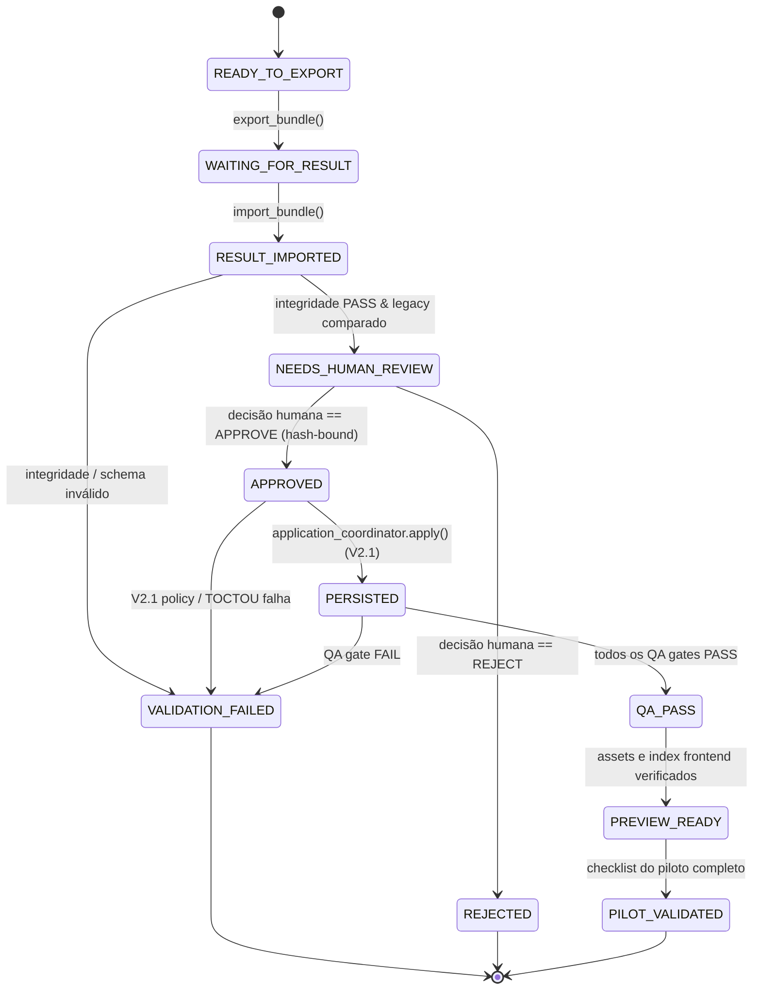

# Daemon Tools — Version 2.2 Design Specification
# Pilot Content Pipeline (End-to-End Book Verification)

## 1. Purpose

Esta especificação define a arquitetura, contratos de dados, máquina de estados, governança de revisão e fluxo de execução da **Version 2.2 — Pilot Content Pipeline** do repositório Daemon Tools.

O objetivo central da Versão 2.2 é fechar o ciclo de ponta a ponta processando **um livro real** desde sua fonte original não estruturada até sua visualização navegável, pesquisável e com relações ativas no frontend atual, exercitando todas as camadas do pipeline:
```text
Fonte Original (Livros/)
  ↓
SOURCE
  ↓
EXTRACTION
  ↓
EDITORIAL
  ↓
ENTITIES
  ↓
RELATIONS
  ↓
VALIDATION
  ↓
LEGACY COMPARISON
  ↓
PILOT HUMAN REVIEW
  ↓
V2.1 PERSISTENCE (Safe Filesystem Mutation)
  ↓
QA / RELEASE GATES
  ↓
FRONTEND PREVIEW
```

---

## 2. V2.1 Baseline

A Versão 2.2 tem como alicerce estrito a **Version 2.1 — Persistence/Application Layer**, congelada e verificada na tag:
- **Tag:** `multiagent-persistence-v2.1`
- **SHA:** `d4622b3cdee956f5cb8dfff34df0a98e3e4dfe13`

Todas as garantias e invariantes de segurança da V2.1 permanecem vigentes e invioláveis:
1. **Nenhuma mutação fora da V2.1:** Toda e qualquer escrita no repositório passa obrigatoriamente pela `ApplicationCoordinator` / `ChangeSetApplier` da V2.1. O pipeline piloto não possui autoridade direta sobre o sistema de arquivos.
2. **ACCEPT Boundary:** O construtor de alterações (`ChangeSetBuilder`) e o coordenador de aplicação exigem deterministamente veredicto `ACCEPT` emitido pelo validador técnico.
3. **Interseção Estrita de Autoridade:** $\text{Scope} = \text{allowedWriteScope} \cap \text{AutoApplyRoots} \cap \text{ApplicationPolicy}$.
4. **Proteção TOCTOU e Primitivas Atômicas:** Revalidação imediata pré-mutação em disco, `open(..., "xb")` para `CREATE`, `os.replace` no mesmo volume para `UPDATE`, e journal de reversão compensatória.
5. **Neutralidade de Provedor e Isolamento de Bundles:** Os bundles operacionais residem fora da árvore versionada do Git, em diretório de runtime seguro no mesmo filesystem.

---

## 3. Goals (Metas da Versão 2.2)

1. **Processar 1 Livro Real:** Executar a extração, estruturação, catalogação e integração de uma obra completa a partir de seu arquivo original em `Livros/`.
2. **Exercitar Todos os Estágios do Pipeline:** SOURCE, EXTRACTION, EDITORIAL, ENTITIES, RELATIONS, FRONTEND, QA e RELEASE.
3. **Operacionalizar a Ponte de Transporte Manual com Antigravity:** Implementar o protocolo estruturado e auditável de exportação de `ExecutionBundle` e importação de `ResultBundle` para uso pelo operador humano, sem automações frágeis.
4. **Vínculo Criptográfico Bidirecional de Bundles:** Garantir que o `ResultBundle` esteja vinculado por hashes imutáveis (`requestId`, `executionBundleId`, `inputManifestSha256`, `artifactHashes`) ao lote de entrada correspondente.
5. **Validador de Integridade de Importação:** Estabelecer a fronteira `BundleIntegrityValidator` para barrar dados corrompidos, incompletos ou adulterados antes de qualquer avaliação de regras de negócio.
6. **Comparador com Dados Legados (`LegacyComparator`):** Contrastar semanticamente o resultado do pipeline com referências derivadas antigas para detectar regressões, omissões ou refinamentos legítimos, sem conferir autoridade ao legado.
7. **Revisão Humana Obrigatória no Piloto:** Nenhuma persistência ocorre no primeiro piloto sem decisão explícita e registrada de aprovação humana vinculada ao hash do manifesto.
8. **Integração Mínima com Frontend Atual:** Permitir que as novas entidades e relações do livro piloto sejam navegadas, filtradas e buscadas no visualizador existente (`docs/index.html`, `docs/assets/app.js`), sem refatorações de framework.
9. **Ambiente de Preview Local/Branch:** Garantir a validação visual do livro em servidor local ou preview de branch, sem deploy automático para o GitHub Pages de produção.
10. **Testabilidade Hermética:** 100% dos novos componentes testáveis offline, sem dependência de tokens, redes ou serviços externos.

---

## 4. Non-Goals (Fora do Escopo da Versão 2.2)

1. **Automação de API com Antigravity / Gemini:** Integração de rede direta continua classificada como `DEFERRED_PENDING_RUNTIME_API`.
2. **Automação de Navegador ou Interface Gráfica:** Proibido o uso de Selenium, Playwright, Puppeteer, PyAutoGUI ou scripts de controle de navegador.
3. **Assinaturas Digitais PKI:** A integridade é garantida por hashes SHA-256 e amarração de manifestos; infraestrutura de chaves assimétricas fica postergada.
4. **Reconciliação Semântica Automática:** Divergências semânticas entre novo dado e legado exigem revisão humana; não haverá heurística de resolução automática de regras de RPG.
5. **Publicação Automática em Produção:** O GitHub Pages oficial não recebe deploy durante os testes do piloto.
6. **Redesign do Frontend ou Migração de Stack:** Nenhuma reescrita em React, Vue, Svelte, Next.js ou adoção de novo design system. Apenas ajustes pontuais na aplicação vanilla existente.
7. **Processamento em Lote Multi-Livro:** Apenas 1 livro piloto será processado. Não haverá processamento massivo simultâneo.
8. **Execução Paralela de Agentes em Swarm:** Os jobs são executados sequencialmente em lotes controlados.

---

## 5. Critérios de Sucesso do Piloto (`V2.2 VERIFIED`)

Para que a Versão 2.2 seja declarada **VERIFIED**, é necessário satisfazer todos os seguintes critérios objetivos:

1. **Fonte Real Processada:** 1 livro selecionado deterministicamente a partir de seu arquivo original em `Livros/`.
2. **Cadeia Completa Concluída:** Dados transformados através de todos os estágios formais do pipeline.
3. **Ponte Manual Operada com Sucesso:** Exportação de bundles pelo Daemon, preenchimento assistido pelo Antigravity/Gemini e importação sem falhas de formato.
4. **Integridade de Bundle Validada:** `BundleIntegrityValidator` aprova a amarração de identidade, hashes de manifestos e ausência de adulteração.
5. **Divergências Semânticas Auditadas:** O `LegacyComparator` classifica todas as alterações e direciona diferenças semânticas para aprovação.
6. **Aprovação Humana Registrada:** Decisão formal de revisão emitida e vinculada criptograficamente ao manifesto do resultado.
7. **Persistência Exclusiva via V2.1:** Arquivos gravados no repositório estritamente através do `ApplicationCoordinator` da V2.1, com journals limpos e sem violações TOCTOU.
8. **QA Automatizado Verde:** Suíte de testes (`pytest`), `validate_data.py`, `check_book_coverage.py` e sintaxe JS aprovados.
9. **Navegabilidade Comprovada:** O livro piloto aparece no visualizador local, com listagem de seções e entidades.
10. **Busca Funcional:** Termos e entidades do livro piloto retornam nos filtros e busca do frontend.
11. **Relações Clicáveis:** Links cruzados entre entidades (ex.: poderes associados, pré-requisitos, regras de raça/kit) navegam corretamente na interface.

---

## 6. Procedimento de Seleção do Livro Piloto

### 6.1 Critérios Determinísticos de Avaliação

A seleção da obra para o primeiro teste integrado do pipeline obedece a uma pontuação determinística baseada em 6 dimensões fundamentais:

| Critério | Descrição | Peso | Métrica Ideal |
|:---|:---|:---:|:---|
| **C1. Disponibilidade de Fonte Original** | Arquivo limpo em `Livros/word/` ou `Livros/` | 20% | DOCX íntegro com parsing verificado |
| **C2. Existência de Dados Legados** | Presença em `data/books/` e `data/pilot/` | 20% | Cobertura prévia 100% e áreas catalogadas |
| **C3. Qualidade da Fonte** | Baixo ruído de OCR e formatação consistente | 20% | `badLineScore == 0.0` no relatório de qualidade |
| **C4. Complexidade e Extensão Gerenciável** | Extensão viável para transporte manual controlado | 15% | 10 a 50 páginas (evita micro-fragmentos e behemoths) |
| **C5. Representatividade do Domínio Daemon** | Variedade de classes de entidades | 15% | Mínimo 4 áreas (Lore, Regras, Opções/Poderes, NPCs) |
| **C6. Compatibilidade de Direitos e Publicação** | Suplemento com direitos claros/abertos para referência | 10% | Material de regras e fichas sem embaraço autoral |

### 6.2 Shortlist Auditável de Candidatos

A auditoria direta sobre os 228 arquivos DOCX em `Livros/word/` cruzados com `data/books/` e `data/pilot/` resultou na seguinte shortlist ordenada:

```text
+--------------------------------+-------+----------+---------+-----------------------------------------+--------------------+
| Livro Candidato                | Págs. | Chars    | Tables  | Áreas Representadas                     | Classificação      |
+--------------------------------+-------+----------+---------+-----------------------------------------+--------------------+
| 1. animalidade                 |    13 |   58.659 |       0 | Lore, Regras, Rituais, Poderes,         | RECOMENDADO        |
|                                |       |          |         | Aprimoramentos, Raças, NPCs             | (Piloto Principal) |
+--------------------------------+-------+----------+---------+-----------------------------------------+--------------------+
| 2. alastores-a-justica-infernal|    43 |   88.518 |       0 | Lore, Poderes, Aprimoramentos, Classes, | ALTERNATIVA A      |
|                                |       |          |         | Itens, Rituais, Criaturas/NPCs          | (Piloto Médio)     |
+--------------------------------+-------+----------+---------+-----------------------------------------+--------------------+
| 3. anoes                       |     8 |   37.190 |       0 | Aprimoramentos, Lore, Itens, Kits, Raças| ALTERNATIVA B      |
|                                |       |          |         |                                         | (Piloto Curto)     |
+--------------------------------+-------+----------+---------+-----------------------------------------+--------------------+
| 4. anjos-cacadores-alados      |    43 |  116.108 |       0 | Lore, Raças, Manobras, Aprimoramentos,  | ALTERNATIVA C      |
|                                |       |          |         | Poderes, Criaturas/NPCs                 | (Piloto Médio)     |
+--------------------------------+-------+----------+---------+-----------------------------------------+--------------------+
```

### 6.3 Justificativa do Candidato Recomendado (`animalidade`)

O livro **`animalidade`** é designado como o **Piloto Principal Recomendado**:
- **Tamanho Ideal:** 13 páginas originais. Permite a divisão em 3 a 5 jobs modulares de extração e estruturação, tornando o ciclo de transporte manual ágil e auditável sem sobrecarregar o operador.
- **Riqueza de Domínio Excepcional:** Contém praticamente todas as categorias fundamentais do ecossistema Daemon:
  - *Identificação de Fonte:* Metadados e créditos.
  - *Raça / Linhagem:* Metamorfos e Feras (`race_lineage`).
  - *Cenário e Lore:* A Fúria de Gaea, Ciganos, Leis e Umbral (`setting_lore`).
  - *Opções de Personagem:* Regras de criação, Aprimoramentos e Fraquezas (`character_option`).
  - *Poderes e Magia:* Formas e Poderes Animais, Rituais (`power_magic`).
  - *Criaturas e NPCs:* Fichas completas com atributos e perícias (`creature_npc`).
- **Qualidade de Fonte Impecável:** Documento `animalidade.docx` possui `badLineScore: 0.0`, zero caracteres corrompidos, texto fluído e sem tabelas truncadas.
- **Regra de Não-Contaminação:** O pipeline para `animalidade` começará estritamente de `Livros/word/animalidade.docx`. Os arquivos pré-existentes (`data/pilot/animalidade.json` e `data/books/animalidade.json`) serão utilizados exclusivamente pelo `LegacyComparator` como espelho comparativo, nunca como insumo de extração.

---

## 7. Arquitetura do Piloto

O fluxo operacional da Versão 2.2 desacopla a orquestração interna do Daemon do motor de inferência externo através de bundles serializados em disco:

```text
┌────────────────────────────────────────────────────────────────────────┐
│ DAEMON RUNTIME (Local Python Engine)                                   │
│                                                                        │
│   [Pilot Job Definition]                                               │
│             ↓                                                          │
│   [ExecutionBundleExporter]                                            │
│             ↓                                                          │
│   (outgoing/bundle-<id>/) ──────────────────────────┐                  │
└─────────────────────────────────────────────────────┼──────────────────┘
                                                      │
                                             [Manual Transport]
                                             (Operador Humano)
                                                      │
┌─────────────────────────────────────────────────────┼──────────────────┐
│ EXTERNAL MODEL ENVIRONMENT                          │                  │
│                                                     ▼                  │
│   Antigravity / Gemini Workspace ──→ (Produz Resposta e Artefatos)     │
│                                                     │                  │
└─────────────────────────────────────────────────────┼──────────────────┘
                                                      │
                                             [Manual Transport]
                                             (Operador Humano)
                                                      │
┌─────────────────────────────────────────────────────┼──────────────────┐
│ DAEMON RUNTIME (Local Python Engine)                ▼                  │
│                                           (incoming/bundle-<id>/)      │
│                                                     ↓                  │
│   [ResultBundleImporter]                                               │
│             ↓                                                          │
│   [BundleIntegrityValidator] ──→ (Falha?) ──→ [REJECTED / BLOCKED]     │
│             ↓ (Pass)                                                   │
│   [ExecutionResultValidator] ──→ (Não ACCEPT?) ──→ [BLOCKED]           │
│             ↓ (Pass)                                                   │
│   [LegacyComparator]                                                   │
│             ↓                                                          │
│   [Pilot Review Request] ──→ (Avaliação Humana) ──→ [REJECTED]         │
│             ↓ (APPROVED com hash bound)                                │
│   [ApplicationCoordinator V2.1]                                        │
│             ↓ (Atomic Mutation)                                        │
│   [Repository Working Tree]                                            │
│             ↓                                                          │
│   [QA / Release Gates] ──→ (Falha?) ──→ [QA_FAILED]                    │
│             ↓ (Pass)                                                   │
│   [Frontend Local Preview]                                             │
└────────────────────────────────────────────────────────────────────────┘
```

### Limites e Invariantes do `PilotCoordinator`:
1. **Sem Chamada Direta de API:** O coordenador exporta arquivos e aguarda o retorno; não instancia sockets de rede nem automatiza chamadas de modelo.
2. **Sem Escrita Direta no Repositório:** A única entidade que escreve na working tree é a camada de persistência da V2.1 (`ApplicationCoordinator`).
3. **Sem Decisão Hermenêutica de RPG:** Em caso de ambiguidade nas regras da fonte, o sistema emite apontamento para decisão humana; o coordenador nunca inventa valores mecânicos.
4. **Sem Publicação Automática:** A liberação para preview é estritamente local (`localhost` ou preview de branch).

---

## 8. Máquina de Estados do Piloto

O processamento de cada etapa do livro piloto obedece à seguinte máquina de estados finita determinística:



### Regras Estritas de Transição:
- **Proibido Pular Validação:** É impossível transitar de `RESULT_IMPORTED` diretamente para `APPROVED` ou `PERSISTED`.
- **Proibido Pular Revisão Humana:** É impossível transitar de `RESULT_IMPORTED` para `APPROVED` sem registro formal de aprovação assinado com o SHA-256 do manifesto do resultado.
- **Fail-Closed:** Qualquer falha em `BundleIntegrityValidator`, `ExecutionResultValidator`, `LegacyComparator` ou gates de QA bloqueia o avanço imediatamente.

---

## 9. Especificação do Execution Bundle

O `Execution Bundle` é o pacote autocontido gerado pelo Daemon para consumo pelo operador e modelo.

### 9.1 Estrutura em Disco
```text
<bundle-runtime-storage>/outgoing/<executionBundleId>/
├── execution-request.json      # Payload canônico em conformidade com execution-request.schema.json
├── prompt.md                   # Instruções procedurais renderizadas para o agente do estágio
├── output-contract.json        # Schema JSON esperado para os artefatos de saída
├── context-manifest.json       # Manifesto com inventário e hashes de todos os insumos
├── context/                    # Diretório com arquivos de contexto materializados (texto, regras, schemas)
│   ├── source_excerpt.txt
│   └── domain_rules.md
└── attachments/                # (Opcional) Anexos binários estritamente necessários
```

### 9.2 Context Manifest (`context-manifest.json`)
O manifesto de contexto registra a proveniência exata de tudo o que foi entregue ao executor:

```json
{
  "$schema": "https://daemon.tools/schemas/context-manifest.schema.json",
  "bundleId": "EB-ANIM-001-EXTRACTION",
  "requestId": "req-anim-ext-001",
  "jobId": "JOB-ANIM-001",
  "stage": "EXTRACTION",
  "bookId": "animalidade",
  "createdAt": "2026-09-08T18:00:00Z",
  "totalBytes": 124500,
  "items": [
    {
      "logicalPath": "context/source_excerpt.txt",
      "role": "primary_source",
      "sourceUri": "Livros/word/animalidade.docx#pages=1-5",
      "sizeBytes": 24500,
      "sha256": "3a7b8c...",
      "mediaType": "text/plain; charset=utf-8"
    },
    {
      "logicalPath": "context/cataloging-rules.md",
      "role": "guideline",
      "sourceUri": "docs/reference/cataloging-rules.md",
      "sizeBytes": 15200,
      "sha256": "4b8c9d...",
      "mediaType": "text/markdown; charset=utf-8"
    }
  ]
}
```

*Regra Inviolável:* O bundle deve conter apenas o contexto essencial para a tarefa específica do job. É expressamente proibido fazer "context dumping" de livros inteiros ou dependências não relacionadas.

---

## 10. Especificação do Result Bundle

O `Result Bundle` é o pacote retornado pelo executor contendo a resposta e os artefatos estruturados gerados.

### 10.1 Estrutura em Disco
```text
<bundle-runtime-storage>/incoming/<resultBundleId>/
├── execution-result.json       # Payload canônico em conformidade com execution-result.schema.json
├── result-manifest.json        # Manifesto com inventário, hashes e correlação com a entrada
└── artifacts/                  # Arquivos resultantes gerados pelo modelo
    ├── data/text/animalidade.txt
    └── data/books/animalidade.json
```

### 10.2 Result Manifest (`result-manifest.json`)
```json
{
  "$schema": "https://daemon.tools/schemas/result-manifest.schema.json",
  "resultBundleId": "RB-ANIM-001-EXTRACTION",
  "executionBundleId": "EB-ANIM-001-EXTRACTION",
  "requestId": "req-anim-ext-001",
  "inputManifestSha256": "e3b0c44298fc1c149afbf4c8996fb92427ae41e4649b934ca495991b7852b855",
  "createdAt": "2026-09-08T18:15:00Z",
  "artifacts": [
    {
      "logicalPath": "data/text/animalidade.txt",
      "artifactType": "extracted_text",
      "sizeBytes": 22400,
      "sha256": "9f8e7d...",
      "encoding": "utf-8"
    },
    {
      "logicalPath": "data/books/animalidade.json",
      "artifactType": "book_segmentation",
      "sizeBytes": 4500,
      "sha256": "1a2b3c...",
      "encoding": "utf-8"
    }
  ]
}
```

---

## 11. Vínculo Criptográfico e Integridade de Identidade

Para prevenir ataques de confusão de contexto, substituição acidental de pacotes ou dessincronização entre prompts e respostas, o importador impõe 4 amarrações determinísticas:

1. **Request ID Matching:** `result.requestId == request.requestId`.
2. **Bundle ID Matching:** `result.executionBundleId == bundle.executionBundleId`.
3. **Input Manifest Hash Binding:** O `result-manifest.json` deve declarar `inputManifestSha256` igual ao SHA-256 exato calculado sobre o arquivo `context-manifest.json` da entrada.
4. **Artifact Content Digest Matching:** Para cada artefato presente no diretório `artifacts/`:
   - O caminho relativo deve constar em `result-manifest.json` e em `proposedArtifacts` de `execution-result.json`.
   - O SHA-256 calculado diretamente sobre os bytes do arquivo em disco deve bater com o hash declarado no manifesto.
   - Não são permitidos arquivos órfãos (arquivos na pasta sem registro no manifesto).
   - Não são permitidos arquivos fantasma (arquivos no manifesto ausentes na pasta).

*Qualquer divergência nestes 4 pontos resulta em rejeição imediata com código `ERR_RESULT_BUNDLE_INTEGRITY_FAILED`.*

---

## 12. Armazenamento de Runtime e Governança de Diretórios

Os bundles de transporte são efêmeros e operacionais. Portanto:
- **Localização:** Ficam localizados fora do repositório Git, no diretório de runtime padrão derivado confiavelmente ao lado do projeto:
  `<repository-parent>/.daemon_runtime/bundles/`
- **Subdiretórios de Ciclo de Vida:**
  - `outgoing/`: Bundles exportados prontos para envio.
  - `incoming/`: Bundles recebidos aguardando importação.
  - `accepted/`: Bundles importados com integridade comprovada e auditada.
  - `rejected/`: Bundles cuja importação ou integridade falhou (preservados para diagnóstico).
- **Isolamento de Segurança:** Este diretório nunca pode ser alvo de operações de um `ChangeSet` e não é acessível a comandos do modelo.

---

## 13. Política de Retenção e Auditoria

1. **Retenção Permanente (Metadados de Governança):**
   - No histórico do Git e logs de auditoria, são mantidos indefinidamente: `requestId`, `executionBundleId`, manifestos JSON completos, hashes de entrada e saída, histórico de decisões de revisão humana e journals de persistência.
2. **Retenção Temporária (Payloads Volumosos):**
   - Os diretórios de staging e bundles brutos contendo textos completos e extrações brutas podem ser limpos após a persistência bem-sucedida no repositório.
   - Não é necessário acumular gigabytes de bundles em disco após a promoção final da versão.

---

## 14. Importador e Validador de Integridade (`BundleIntegrityValidator`)

O `BundleIntegrityValidator` atua como a primeira linha de defesa antes de qualquer processamento semântico. Suas verificações são executadas em ordem estrita:

1. **Validação de Schema dos Manifestos:** Conformidade com `result-manifest.schema.json` e `execution-result.schema.json`.
2. **Verificação de Identidade Cruzada:** Confronto de IDs contra o bundle de saída registrado.
3. **Integridade de Hashes:** Verificação byte-a-byte de cada arquivo na pasta `artifacts/`.
4. **Hardening de Caminhos de Artefatos:** Cada caminho de saída é inspecionado contra traversal (`..`), drive letters, prefixos UNC, ADS (`:`) e dispositivos reservados DOS.
5. **Limites de Recursos:** Garantia de que nenhum artefato excede 50MB e o pacote total não excede 200MB.

---

## 15. Comparador com Legado (`LegacyComparator`)

Para o livro piloto, existem dados catalogados nas primeiras versões do projeto (`data/pilot/`, `data/books/`). Esses dados NÃO são fonte de verdade, mas servem como instrumento de controle de qualidade para alertar o operador humano sobre possíveis perdas ou alterações conceituais.

O `LegacyComparator` opera comparando as entidades recém-extraídas com as entidades históricas:

### Classificações do Comparador:
1. **`SEMANTIC_EQUIVALENT`:**
   - Atributos numéricos, dados vitais, modificadores de regras e essência do texto idênticos ao legado (variações mínimas de pontuação ou espaços ignoradas).
   - *Ação:* Avança automaticamente para o próximo gate.
2. **`STRUCTURAL_DIFFERENCE_ONLY`:**
   - Informação equivalente, mas reestruturada para o novo schema canônico (ex.: atributos de statblock organizados em dicionário tipado em vez de string corrida; campos normalizados; novos IDs padronizados).
   - *Ação:* Avança com registro de log de auditoria.
3. **`SEMANTIC_DIFFERENCE`:**
   - Valores mecânicos divergentes (ex.: Força 15 vs 18; PV 25 vs 19), poderes adicionados ou omitidos, interpretação conflitante de regras ou nomes de perícias ausentes.
   - *Ação:* Bloqueia avanço automático. Gera alerta detalhado de discrepância exigindo resolução humana no `PilotReviewRecord`.
4. **`NO_LEGACY_REFERENCE`:**
   - Entidade ou regra nova extraída da fonte original que não constava no extrato legado antigo.
   - *Ação:* Registrado como novo conteúdo descoberto e apresentado na revisão.

---

## 16. Protocolo de Revisão Humana do Piloto (`PilotReviewRecord`)

No primeiro livro piloto, **nenhuma persistência ocorre sem aprovação humana expressa**.

### 16.1 Contrato da Decisão de Revisão
A infraestrutura reaproveita e estende semanticamente o schema `schemas/review-request.schema.json`. A decisão aprovada é materializada em um registro de revisão auditável:

```json
{
  "$schema": "https://daemon.tools/schemas/pilot-review.schema.json",
  "reviewId": "REV-ANIM-001",
  "requestId": "req-anim-ext-001",
  "executionBundleId": "EB-ANIM-001-EXTRACTION",
  "resultBundleId": "RB-ANIM-001-EXTRACTION",
  "reviewedResultManifestSha256": "7c9f8e...",
  "legacyComparisonSummary": {
    "status": "SEMANTIC_DIFFERENCE_RESOLVED",
    "equivalentCount": 14,
    "structuralDifferenceCount": 8,
    "semanticDifferenceCount": 2,
    "newEntitiesCount": 3
  },
  "decision": "APPROVE",
  "reviewer": "operador-humano",
  "rationale": "Divergências na ficha de NPC Lobo foram conferidas contra a página 11 da fonte original DOCX e corrigem erro antigo do legado.",
  "resolvedAt": "2026-09-08T18:30:00Z"
}
```

### 16.2 Invalidação Criptográfica da Revisão
Se qualquer artefato no `ResultBundle` for recalculado, editado ou substituído após a revisão humana, o `reviewedResultManifestSha256` não baterá mais. A revisão é declarada **INVALIDADA** (`ERR_REVIEW_HASH_MISMATCH`) e o pipeline bloqueia o avanço até que uma nova aprovação humana seja emitida.

---

## 17. Integração com a Persistência V2.1

A integração com o sistema de arquivos ocorre única e exclusivamente via **`ApplicationCoordinator` da V2.1**:

```python
# Pseudo-código de invocação da persistência no PilotCoordinator:
if review_record.decision == "APPROVE" and integrity_result.valid:
    app_result = application_coordinator.coordinate_application(
        request=execution_request,
        result=execution_result,
        verdict=execution_verdict  # Verdict determinístico ACCEPT
    )
    if app_result.status != "APPLIED":
        raise PilotPersistenceError(f"V2.1 Persistence rejected: {app_result.failure_code}")
```

Nenhum arquivo é copiado ou movido diretamente para as pastas do repositório fora dessa chamada.

---

## 18. Gates de QA e Release

Após a aplicação bem-sucedida na working tree, o `PilotCoordinator` dispara a suíte de validação de qualidade:
1. `python -m pytest tests/agents -q`
2. `python -m pytest -q`
3. `python scripts/validate_data.py`
4. `python scripts/check_book_coverage.py`
5. `node --check docs/assets/app.js`
6. **Validação de Proveniência:** Verificação de que 100% das entidades persistidas contêm `source` válido e `pages` mapeadas.
7. **Validação de Referências Cruzadas:** Nenhuma relação aponta para entidade inexistente sem anotação de unresolved.

---

## 19. Integração com Frontend e Política de Preview

### 19.1 Adaptações Permitidas no Frontend Existente
Para que o livro piloto seja navegável, a V2.2 fará apenas os ajustes mínimos estritamente necessários na aplicação existente (`docs/index.html`, `docs/assets/app.js`):
- Suporte à exibição de novos atributos e blocos introduzidos pela obra (ex.: tabela de metamorfose, poderes e fraquezas de fera).
- Indexação das novas entidades no motor de busca em memória do frontend.
- Links clicáveis de relacionamento entre a classe/raça e seus poderes associados.

### 19.2 Proibições Estritas no Frontend
- Proibido qualquer redesign visual global.
- Proibida a introdução de novos frameworks (React, Vue, Tailwind, Bootstrap).
- Proibida a reestruturação da arquitetura de navegação do site.

### 19.3 Política de Preview e Publicação
- O teste do livro ocorre exclusivamente via servidor HTTP local (`python -m http.server`) ou na visualização da branch `feat/pilot-content-pipeline-v2-2`.
- O GitHub Pages de produção (`main`) NÃO recebe deploy automático nesta versão.
- A promoção para publicação pública requer: piloto integralmente aprovado, QA 100% verde e liberação explícita de direitos autorais.

---

## 20. Taxonomia Canônica de Falhas

A Versão 2.2 padroniza a seguinte taxonomia de erros fail-closed:

| Código Canônico | Categoria | Descrição | Ação |
|:---|:---|:---|:---|
| `ERR_EXECUTION_BUNDLE_INVALID` | Export | Bundle de saída malformado ou incompleto | Aborta exportação |
| `ERR_EXECUTION_BUNDLE_INTEGRITY_FAILED` | Export | Divergência de hash no manifesto de contexto | Aborta exportação |
| `ERR_RESULT_BUNDLE_INVALID` | Import | Falha de schema no pacote de retorno | `BLOCKED` |
| `ERR_RESULT_BUNDLE_INTEGRITY_FAILED` | Import | Hashes de arquivos não batem com manifesto | `BLOCKED` |
| `ERR_REQUEST_ID_MISMATCH` | Binding | ID do request de retorno diverge da saída | `BLOCKED` |
| `ERR_BUNDLE_ID_MISMATCH` | Binding | ID do bundle de retorno diverge da saída | `BLOCKED` |
| `ERR_INPUT_MANIFEST_HASH_MISMATCH` | Binding | Retorno não referencia o manifesto de entrada exato | `BLOCKED` |
| `ERR_ARTIFACT_HASH_MISMATCH` | Integrity | Bytes em disco não correspondem ao hash | `BLOCKED` |
| `ERR_UNEXPECTED_ARTIFACT` | Integrity | Arquivo presente na pasta mas não no manifesto | `BLOCKED` |
| `ERR_MISSING_ARTIFACT` | Integrity | Arquivo declarado no manifesto ausente na pasta | `BLOCKED` |
| `ERR_RESULT_CONTRACT_INVALID` | Contract | Falha na validação semântica da V2 | `BLOCKED` |
| `ERR_SEMANTIC_DIFFERENCE_REQUIRES_REVIEW` | Legacy | Divergência semântica contra legado | `HUMAN_REVIEW` |
| `ERR_REVIEW_REQUIRED` | Review | Tentativa de persistência sem registro de revisão | `BLOCKED` |
| `ERR_REVIEW_REJECTED` | Review | Revisor humano rejeitou a proposta | `REJECTED` |
| `ERR_REVIEW_HASH_MISMATCH` | Review | Artefatos adulterados após aprovação humana | `BLOCKED` |
| `ERR_PERSISTENCE_FAILED` | Persistence| Rejeição ou rollback na camada V2.1 | `BLOCKED` |
| `ERR_QA_FAILED` | QA | Falha em testes, schemas ou cobertura de livros | `QA_FAILED` |
| `ERR_FRONTEND_INTEGRATION_FAILED` | UI | Dados do livro quebram renderizador local | `BLOCKED` |
| `ERR_PREVIEW_VALIDATION_FAILED` | Preview | Falha no checklist visual/navegacional do piloto | `BLOCKED` |
| `ERR_RIGHTS_PUBLICATION_BLOCKED` | Rights | Violação da política de publicação autoral | `BLOCKED` |

---

## 21. Estratégia de Testes e CI

### 21.1 Testes Unitários e Herméticos
1. `test_bundle_exporter.py`: Testa a criação de bundles autocontidos, geração de `context-manifest.json`, cálculo de hashes e limites de tamanho em ambiente isolado (`tmp_path`).
2. `test_bundle_importer.py`: Testa a leitura de pacotes, detecção de caminhos e estruturação em memória.
3. `test_bundle_integrity_validator.py`: Testa rejeição de hashes adulterados, arquivos extras, arquivos faltando, IDs divergentes e caminhos com path traversal.
4. `test_legacy_comparator.py`: Testa os 4 veredictos de comparação semântica com fixtures de dados antigos e novos.
5. `test_pilot_review.py`: Testa validação de aprovação, bloqueio por rejeição e invalidação de aprovação quando o hash do manifesto muda.
6. `test_pilot_coordinator.py`: Testa a máquina de estados completa do piloto usando mocks offline herméticos.
7. `test_pilot_pipeline_e2e.py`: Simulação ponta a ponta de um job piloto com fixtures completas, verificando exportação, importação, validação, revisão simulada, persistência V2.1 e integridade.

### 21.2 Estratégia de CI
O GitHub Actions continuará rodando exclusivamente testes **determinísticos e offline**. Nenhum teste de CI tentará comunicar-se com provedores de IA ou exigir credenciais secretas.

---

## 22. Componentes e Fronteiras de Arquivos Propostos

### 22.1 Novos Schemas JSON
- `schemas/execution-bundle.schema.json`: Contrato do pacote exportado e seu manifesto.
- `schemas/result-bundle.schema.json`: Contrato do pacote importado e seu manifesto.
- `schemas/pilot-review.schema.json`: Contrato do registro de aprovação humana do piloto.

### 22.2 Novos Módulos de Implementação (`scripts/agents/`)
- `scripts/agents/bundle_exporter.py`: Motor de exportação de Execution Bundles e compilação de manifestos.
- `scripts/agents/bundle_importer.py`: Leitura e ingestão de Result Bundles.
- `scripts/agents/bundle_integrity_validator.py`: Verificador determinístico de integridade de pacote e bindings.
- `scripts/agents/legacy_comparator.py`: Comparador de regressão semântica contra dados legados.
- `scripts/agents/pilot_review.py`: Validador e gerenciador de registros de revisão humana.
- `scripts/agents/pilot_coordinator.py`: Orquestrador operacional da máquina de estados do piloto.

### 22.3 Novos Arquivos de Teste (`tests/agents/`)
- `tests/agents/test_bundle_exporter.py`
- `tests/agents/test_bundle_importer.py`
- `tests/agents/test_bundle_integrity_validator.py`
- `tests/agents/test_legacy_comparator.py`
- `tests/agents/test_pilot_review.py`
- `tests/agents/test_pilot_coordinator.py`
- `tests/agents/test_pilot_pipeline_e2e.py`

---

## 23. Sequência de Implementação Proposta (Tasks 35–44)

A execução subsequente seguirá o mesmo modelo controlado por TDD e stop-on-error das versões anteriores:

- **Task 35:** Schemas canônicos (`execution-bundle`, `result-bundle`, `pilot-review`).
- **Task 36:** `ExecutionBundleExporter` e geração do `context-manifest.json`.
- **Task 37:** `ResultBundleImporter` e leitura de pacotes.
- **Task 38:** `BundleIntegrityValidator` e regras de binding criptográfico.
- **Task 39:** `LegacyComparator` e taxonomia de diferenças semânticas.
- **Task 40:** `PilotReviewEngine` e binding criptográfico de aprovação humana.
- **Task 41:** `PilotCoordinator` e integração da máquina de estados com a V2.1.
- **Task 42:** Adaptações mínimas no frontend para renderização do livro piloto.
- **Task 43:** Testes integrados E2E herméticos do pipeline piloto.
- **Task 44:** Execução operacional assistida do primeiro livro piloto real (`animalidade`).

---

## 24. Self-Review de Conformidade Arquitetural

- [x] **Sem escritas diretas no repositório por modelos:** Todo filesystem write passa pela V2.1.
- [x] **Sem bypass de validação:** O resultado bruto não alcança ChangeSet nem filesystem sem veredicto ACCEPT.
- [x] **Hashes em todos os pacotes:** Manifestos contêm SHA-256 e bytes em disco são checados.
- [x] **Resultado vinculado à entrada:** Identificadores e hash do manifesto de contexto amarrados.
- [x] **Legado não é verdade absoluta:** Serve exclusivamente para comparação e alerta, nunca como insumo do pipeline.
- [x] **Revisão obrigatória e à prova de adulteração:** A decisão humana vincula-se ao SHA-256 do manifesto do resultado.
- [x] **Armazenamento de bundles fora do Git:** Pasta `.daemon_runtime/bundles` protegida contra tracking.
- [x] **Sem redesenho prematuro do site:** Frontend mantido em vanilla JS com adições mínimas de campos e busca.
- [x] **Sem automações mágicas de browser:** Transporte manual formal e auditável.
